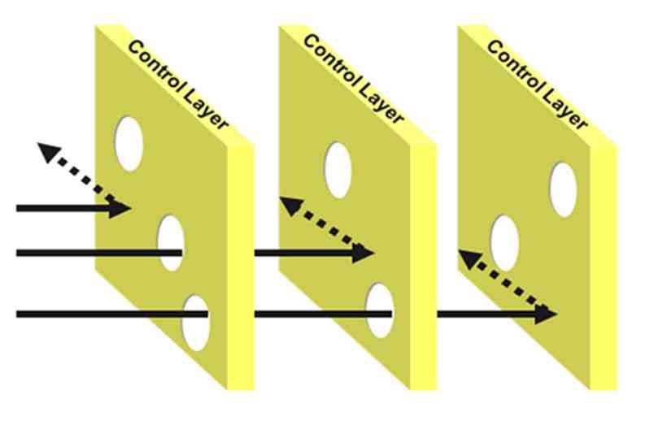

>   *Того, кто не задумывается о далеких трудностях, непременно поджидают
>   близкие неприятности.*

>   *Конфуций*

Возможно вы слышали о Модели швейцарского сыра, или еще ее называют моделью
кумулятивного действия. Она пришла из авиации. Если совсем кратко, то суть этой
модели в том, чтобы ставить на пути вероятного происшествия как можно больше
преград (“ломтиков сыра”). В каждой преграде есть дырки - отдельные упущения и
ошибки (“дырки в сыре” характерны для швейцарских сыров. Отсюда и название).

Такие дыры всегда есть в любой системе на любом уровне - не стоит заблуждаться
на этот счет. Но в каждом следующем уровне, каждом ломтике, эти дыры находятся в
другом месте. Поэтому, когда на одном уровне событие проходит в эту дыру ошибки,
на следующем уровне на пути события дыры нет и это останавливает развитие
нежелательного явления. Такая система преград защищает всю систему от масштабных
инцидентов, которые будет сложно или невозможно устранить. Ведь происшествие
станет возможным только если все упущения или дыры выстроятся в ряд.

Модель Галстук-бабочка — это немного переформулированная идея модели
Швейцарского сыра. В центре ее находится событие, которое мы хотим
предотвратить. Мы можем предпринять определенные меры для его предотвращения. Но
еще мы можем предусмотреть меры по уменьшению ущерба на случай, если это событие
все-таки произойдет. То есть, прогнозируя где можем упасть, мы “соломки
подстелим”.

Модель галстук-бабочка широко известна, даже входит в стандарт ГОСТ Р ИСО 31000.

Применительно к проекту можно рассмотреть эту модель так: с одной стороны у нас
есть дерево угроз - что может пойти не так. А с другой стороны у нас
ограничения, в которые должен уложиться проект.

Сроки, бюджет, удовлетворенность Заказчика, надежность и производительность
системы в общем - любые ограничения, которые фиксируются при запуске проекта.

И вот, мы предполагаем, что может возникнуть некое событие, которое станет
причиной того, что мы не впишемся в ограничения.

Элементы системы управления проектом и отдельные специальные меры, которые мы
предпринимаем вне системы - это те самые преграды, которые стоят на пути у
возможных происшествий.

Пример из области ИТ проектов. Один из типовых рисков для всех ИТ проектов -
задержка принятия ключевых решений, например согласования Технического задания
на систему. Причиной может быть отпуск ключевых согласовантов. Получается
согласовантнов нет -\> ТЗ вовремя не согласовано –\> обязательства Заказчика не
выполнены –\> мы не вписываемся в ограничения по срокам (или начинаем гнать
остальные этапы чтобы все-таки успеть – при этом там появляются свои цепочки
рисков).

Но если мы в рамках выстраивания системы управления проектом введем обязательное
требование – согласовывать отпуск с проектным менеджером, то на пути возникнет
преграда (которая, заметим, может быть и дырявой – особо наделенные властью
согласованты могут просто дружелюбно проигнорировать правило…).

А вот другая распространенная причина проблем с ТЗ – перегрузка сотрудников
операционной работой. Риск настолько распространенный, что в пору вводить его в
список типовых обязательных к отработке в любом корпоративном ИТ проекте.

Ну а теперь к рискам проектов цифровой трансформации. В своей предыдущей статье
«[Использование модели сложности для управления проектами цифровой
трансформации»](https://www.it-world.ru/cionews/management/141468.html) я
показывал, что проекты цифровой трансформации могут быть очень разными – проекты
пилотирования будут содержать одни риски, проекты тиражирования – другие. Список
рисков можно взять из разобранной в статье модели сложности.

А можно – из интернета. Благо при запросе на английском языке «риски проектов
цифровой трансформации (digital transformation project risks) Google выдает
примерно 83 100 000 результатов. При аналогичном запросе на русском примерно 2
500 000 результатов. Есть из чего выбирать.

Мне показался любопытным документ компании Deloitte «[Управление рисками
цифровой трансформации (Managing Risk in Digital
Transformation)](https://www2.deloitte.com/content/dam/Deloitte/in/Documents/risk/in-ra-managing-risk-in-digital-transformation-1-noexp.pdf)».
В нем приводится 10 ключевых нет, не рисков, но областей рисков, из которых
«прилетают» проблемы для проектов цифровой трансформации.

Анализируя примеры известных мне проблемных проектов цифровой трансформации,
могу сказать, что существенная их часть действительно сталкивалась с такими
проблемами. Список явно не выглядит исчерпывающим – в частности в нем в основном
перечислены в основном риски технические, не связанные с человеческой стороной
изменений. И, конечно, упущена одна из главных областей риска для российских
проектов цифровой трансформации – сложнозапутанная внутрикорпоративная политика,
порождение «Византийской» системы управления, но это предмет для отдельной
статьи…

Ну а с технической точки зрения список весьма неплох и вполне может быть
использован как основа для реестра рисков любого проекта цифровой трансформации.
Упражнение по формированию такого реестра и по выбору «ломтиков сыра»,
предотвращающих эти риски предоставляются читателю в качестве самостоятельного
упражнения

Если что-то не будет получаться пишите на адрес <paalferov@yandex.ru> –
разберемся вместе.
