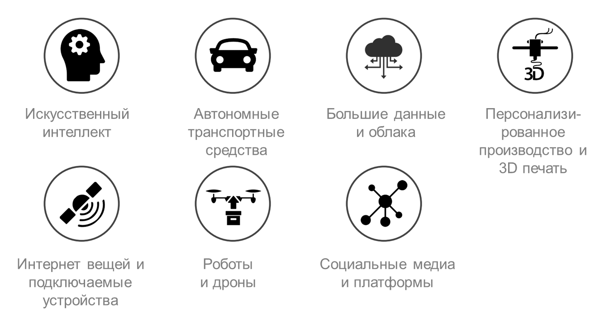
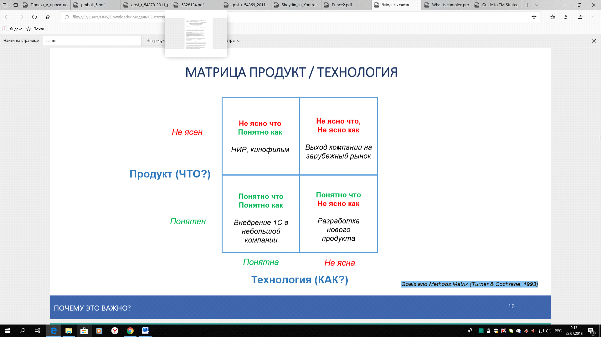
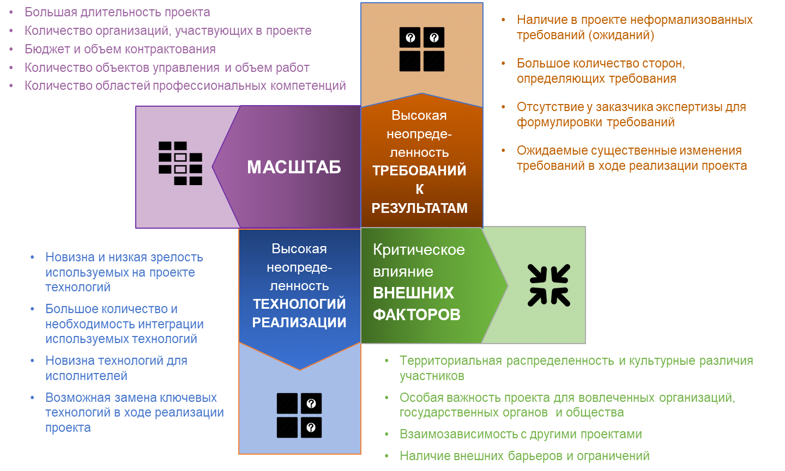
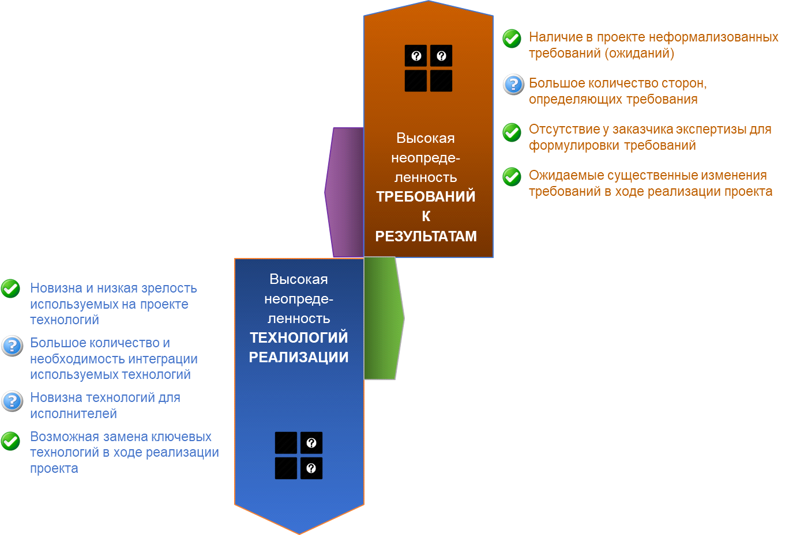
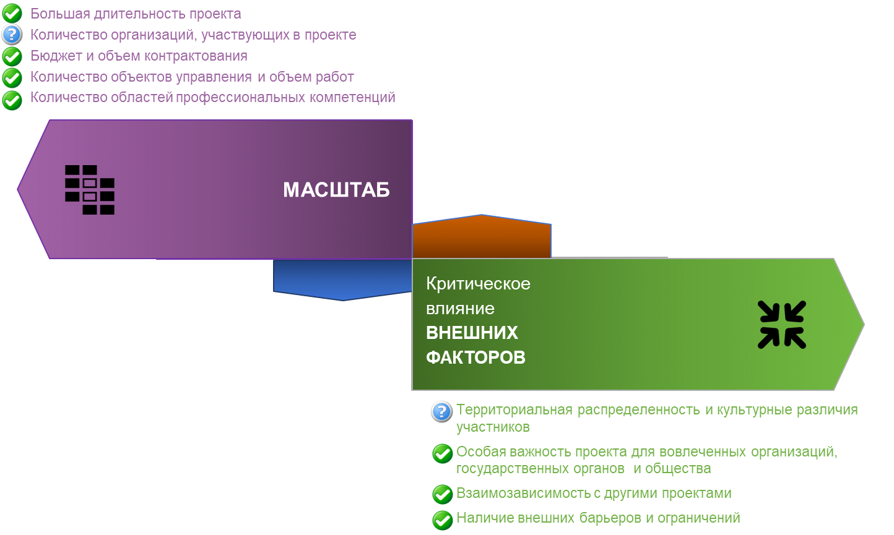
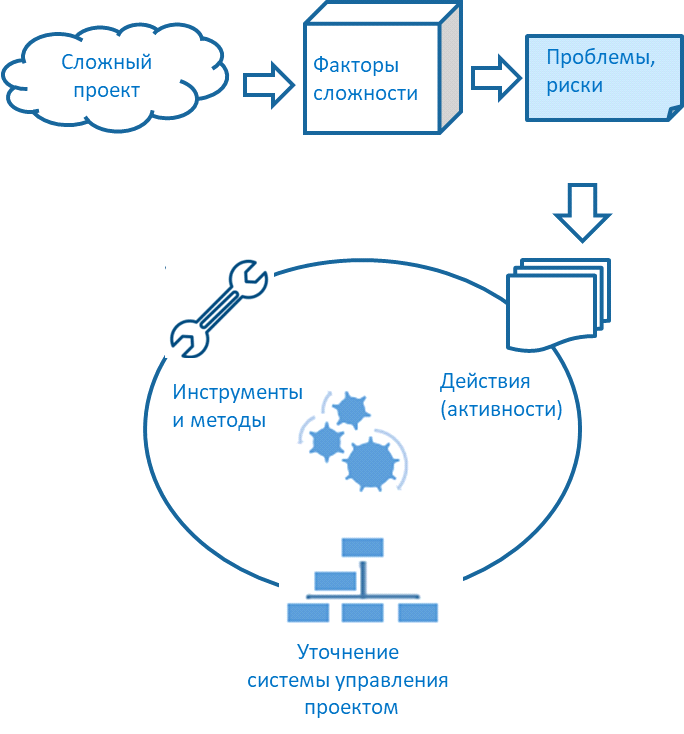

Дискуссии о том, что такое цифровая трансформация, идут уже давно и, на мой
взгляд, довольно неуспешно – единого определения так и не появилось. Только у
меня в базе уже больше двух десятков различных формулировок. Из них с
практической точки зрения больше всего мне нравится определение, которое
предложила на одной из конференций Нина Сухова, директор программ по цифровой
трансформации и непрерывности деятельности ПАО «Газпром нефть»:

*Цифровая трансформация – это симбиоз масштабных технологических и
организационных преобразований, направленных на кардинальное повышение
эффективности бизнеса через его полную оцифровку.*

Из этого определения видно ключевое отличие проектов цифровой трансформации от
уже достаточно хорошо известных и изученных наукой ИТ-проектов. Оно заключается
в масштабе привносимых в компанию изменений и новизне применяемых технологий.

Какие именно технологии обеспечивают эту трансформацию – тоже существует масса
споров и разночтений. Практически каждая уважающая себя консалтинговая компания,
крупные государственные, окологосударственные и совсем не государственные
структуры имеют свои списки. Например, в рамках программы «Цифровая экономика
Российской Федерации» определены девять «сквозных» цифровых технологий:

-   большие данные;

-   нейротехнологии и искусственный интеллект;

-   системы распределенного реестра;

-   квантовые технологии;

-   новые производственные технологии;

-   промышленный Интернет;

-   компоненты робототехники и сенсорика;

-   технологии беспроводной связи;

-   технологии виртуальной и дополненной реальностей.

В общем, о конкретном составе технологий можно спорить: еще с момента первого
появления данного списка в рамках Национальной технологической инициативы у меня
вызывали вопросы технологии беспроводной связи. Поэтому мне несколько ближе
список технологий из доклада Всемирного экономического форума (WEF) .

В любом случае бесспорным представляется то, что эти технологии вышли на участок
повышенной отдачи своих S-кривых. То есть технологические компании еще довольно
долго будут радовать нас своими новинками, одновременно создавая головную боль
крупным корпорациям, – их использование и внедрение становится все более сложной
и все более актуальной задачей. С моей точки зрения, помочь в ее решении может
новая российская модель сложности.

Модель сложности

В России управление сложными проектами только начинает формироваться как раздел
управления. В январе 2018 года Центр оценки и развития проектного управления,
изучив лучшие мировые практики и национальные особенности управления, выпустил
первую версию под названием «Модель сложности проектов ПМ СТАНДАРТ». Мне
посчастливилось стать одним из авторов модели и первым преподавателем на курсах
по ее использованию.

В основу модели сложности легли следующие базовые принципы:

-   **Фокусировка**. Необходимо фокусироваться на ключевых аспектах сложности.

-   **Адаптивность**. Модель должна подстраиваться под конкретные отрасли,
    организации и виды проектов.

-   **Обратная связь**. Предполагаются дополнения и уточнение всех составляющих
    модели по итогам ее применения.

Модель помогает оценить сложность проекта, выявить основные проблемы и корректно
подобрать инструменты работы с ними. За основу была взята концепция Goals and
Methods Matrix (Turner & Cochrane, 1993), которая позволяет оценить сложность
проекта. Согласно этой концепции, сложность проекта определяется двумя основными
факторами: продукт и технология («что делать» и «как делать»).

*Матрица «Продукт/Технология»*

На основании данной матрицы и экспертного обсуждения были сформированы четыре
вида сложности проектов:

• масштаб проекта;

• высокая неопределенность требований к результату;

• высокая неопределенность технологий реализации;

• критическое влияние внешних факторов.

На проекте допустима любая комбинациях видов сложности: проекты могут иметь
сложность по одному из видов или сразу по нескольким.

Общая логика построения модели следующая:

-   Виды сложности группируют **факторы сложности**. Например, для масштаба
    проекта возможными факторами сложности будут являться большая длительность
    проекта, количество организаций, участвующих в его реализации, и т. д.
    Сейчас в модели выделено 17 факторов по всем четырем видам сложности.

-   Факторы сложности измеряются **параметрами оценки сложности**, которые могут
    различаться для проектов разных видов. Так, при оценке фактора «Количество
    объектов управления и большой объем работ» для проектов НИОКР основным
    параметром оценки сложности будет количество создаваемых результатов
    интеллектуальной деятельности (РИД), для ИТ-проектов – количество
    пользователей информационной системы и т. д. Всего выделено свыше 40
    параметров по всем факторам сложности.

-   Факторы сложности определяют **проблемы**, с которыми придется столкнуться
    проекту. В частности, для проекта большой продолжительности это:

-   уменьшение интереса к проекту со стороны заинтересованных сторон;

-   изменение за период реализации проекта персонального состава ключевых лиц,
    принимающих решения по проекту;

-   падение мотивации команды;

-   увольнение ключевых сотрудников, ввод новых участников проекта и т. д.

>   Всего в базе сейчас больше 120 проблем по всем факторам сложности.

-   Проблемы, усложняющие управление проектом, решаются через выполнение
    определенных **действий (активностей)**. Например, для риска увольнения
    ключевых сотрудников это могут быть:

-   совместная работа руководителя проекта с членами проектной команды по
    выравниванию личных планов сотрудника с планами проекта (обсуждение
    перспектив и планов карьерного роста, обсуждение матримониальных планов,
    планов переезда в другой город или страну, планов на отпуск по беременности
    и родам и по уходу за ребенком, согласование планов отпусков с ключевыми
    контрольными точками проекта и т. д.);

-   подготовка планов персонального развития для каждого ключевого участника
    проектной команды на длительную перспективу (желательно до конца проекта);

-   проведение оценки настроения команды и регулярное (раз в неделю, раз в
    месяц, но не реже чем раз в квартал) подведение итогов оценки. Рекомендуемый
    инструмент – «барометр командной работы/опрос удовлетворенности команды»;

-   выстраивание схемы преемственности («правая рука», готовый заменить в случае
    ухода) для каждого ключевого члена проектной команды;

>   и так далее. Всего в базе собрано уже больше 400 активностей.

-   Для более эффективного выполнения активностей существует огромное количество
    моделей, концепций, методик и инструментов управления проектами.

Графическое представление видов и факторов сложности модели

На основе модели сложности ЦОРПУ создана сертификация «Руководитель комплексных
проектов и проектов повышенной сложности». Хотя модель компетенций появилась
только в начале 2018 года, проведено уже полтора десятка сертификаций, модель
доказала свою жизнеспособность и применимость в российских условиях.

Использование модели сложности для проектов цифровой трансформации

Можно сказать, что проекты цифровой трансформации с точки зрения модели
сложности отчитает четкое выделение двух типов:

-   пилотных проектов;

-   проектов масштабирования.

Особое место занимают проекты организации нового бизнеса, основанного на новых
технологиях, – они ближе не к проектному управлению, а к стартапам.

Все перечисленные проекты возникают как результат разработки стратегии
цифровизации компании.

**Пилотные проекты**

Выбранные технологии тестируются на применимость в условиях рынка и
бизнес-модели организации.

Факторы сложности для пилотных проектов:

**Проекты масштабирования**

В рамках проектов масштабирования опробованные на пилотах технологии (см.
определение цифровой трансформации выше) массово внедряются в организации,
перекраивая ее рабочие процессы и операционную модель.

Факторы сложности для проектов масштабирования:

Общий подход к практическому использованию модели на проекте:

-   Определить факторы сложности проекта и провести их оценку по параметрам.

-   На основе наиболее значимых факторов сложности взять из модели проблемы и
    риски, дополнить своими.

-   На основании типовых действий из модели спланировать активности, необходимые
    для борьбы с рисками и проблемами.

-   Модифицировать «штатную» систему управления проектом. Подобрать те
    инструменты и методы управления, которые будут актуальны для условий
    проекта.

Такая работа может быть проведена в рамках одной-двух стратегических сессий с
участием команд управления проектами и ключевых заинтересованных лиц.

Автор будет рад обсудить применимость данной модели для конкретных проектов
читателей. Пожалуйста, пишите на адрес: paalferov\@yandex.ru
