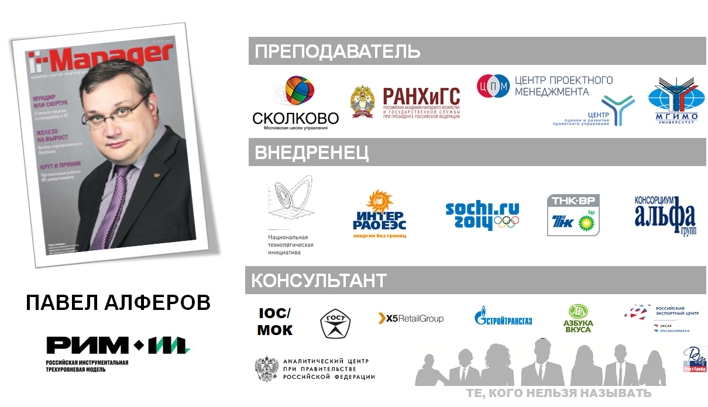

## АЛФЕРОВ ПАВЕЛ АЛЕКСАНДРОВИЧ
email: [paalferov@yandex.ru](paalferov@yandex.ru)

## КРАТКО 

 
## ДЕТАЛИ

### КЛЮЧЕВЫЕ КОМПЕТЕНЦИИ
- **Управление проектами/программами/портфелями проектов**. Более 20 лет опыта. Практическая реализация проектов и программ высокой сложности. Внедрение проектного управления в компаниях, лидерах российского рынка: ТНК-ВР, Альфа-групп, X5 Retail group, Оргкомитет Сочи 2014, НИПК «Электрон», ПАО «ИнтерРАО». Член рабочей группы по созданию национальных стандартов проектного и портфельного управления, системы менеджмента проектной деятельности. Член рабочих групп Федерального проектного офиса. Асессор конкурса «Проектный Олимп» Аналитического центра при Правительстве РФ.
- **Управление информацией и знаниями**. 8 лет опыта. Построение комплексной системы управления знаниями Оргкомитета Сочи 2014. Система получила высокую оценку со стороны Международного Олимпийского Комитета (МОК), ее основные положения включены в обновленную версию Технического Руководства МОК по Управлению знаниями в олимпийских проектах. Действующий эксперт МОК по планированию и управлению знаниями (IOC Advisor). Проводил обучение оргкомитетов Пхенчанг 2018, Токио 2020 и Пекин 2022.
- **Цифровая трансформация бизнеса**. Опыт по планированию и организации работы ИТ для достижения целей бизнеса. Более 25 лет опыта внедрения ИТ систем. Неоднократно входил в Совет Клуба ИТ Директоров 4CIO, Совета itSMF Россия. Один из авторов учебника для ИТ Директоров.
Член организационных комитетов и модератор большого количества конференций, чтение лекций для студентов МВА, мастер-классы, большое количество выступлений и публикаций в области ключевых компетенций.

### ОПЫТ РАБОТЫ

| Период              | Место | 
|-------------------|---------------------|
| Август 2017 – настоящее время | Профессор бизнес-практики в [Московской школе управления СКОЛКОВО](https://www.skolkovo.ru). Независимый эксперт по проектному управлению, управлению знаниями, цифровой трансформации бизнеса |
|Март 2016 – Июль 2017 | Член Правления [АО «РВК»](https://www.rvc.ru), Первый заместитель Директора Проектного офиса Национальной технологической инициативы (НТИ), Член Проектного Комитета, Комитета по координации и контролю, Совета Фонда НТИ, Ответственный секретарь Экспертного совета НТИ |
| Ноябрь 2014 – Март 2016 | Руководитель Центра методологии, экспертизы и контроля проектной деятельности [ПАО «Интер РАО»](www.interrao.ru), член Центрального Проектного Комитета, член Комитета по развитию ИТ |
| Февраль 2013 – Октябрь 2014 | Заместитель Генерального Директора по управлению проектами и информационным сервисам НИПК "Электрон" (г.Санкт-Петербург)
| Октябрь 2008 – Февраль 2013 | Директор Департамента знаний, информации и методологии АНО «Оргкомитет «Сочи 2014» (в январе-феврале 2014 волонтер, Координатор-методолог Главного операционного центра Игр) |
| Сентябрь 2007 – Октябрь 2008 | ТНК-ВР. Руководитель внедрения проектного управления в БЕ "Переработка". Директор ИТ проектов Блока ПиТ |
| Май 2006 – Август 2007 | [Консорциум Альфа Групп](www.alfagroup.ru). Заместитель Директора по ИТ. [X5 Retail Group N.V.](www.x5.ru). Заместитель Директора Департамента Стратегии ИТ (Параллельно с работой в Консорциуме) |
| Ноябрь 2000 – Май 2006 | ОАО «Тюменская нефтяная компания», затем ОАО «ТНК-ВР Менеджмент» Начальник отдела веб-систем и параллельно Заместитель руководителя Экспертного центра по CVP и управлению проектами. С 01.01.2006 Руководитель Центра экспертизы и контроля ИТ проектов
| 1988 – 2000 | Работа в качестве начальника зам.начальника управления, начальника отдела, программиста и аналитика в коммерческих организациях и банках

### ДОПОЛНИТЕЛЬНАЯ ИНФОРМАЦИЯ
* Член рабочей группы по разработке национальных стандартов: ГОСТ 54869-2011 «Проектный менеджмент. Требования к управлению проектом», ГОСТ 54870-2011 «Проектный менеджмент. Требования к управлению портфелем проектов», ГОСТ 57002-2016 «Система менеджмента проектной деятельности»
* [Разработчик сертификации «Руководитель комплексных проектов и проектов повышенной сложности»](https://www.isopm.ru/sertifikatsiya/urovni/rukovoditel-kompleksnykh-proektov/) 
* Член рабочих групп при Федеральном проектном офисе
* Асессор конкурса [«Проектный Олимп»](http://olimp.ac.gov.ru/) Аналитического центра при Правительстве РФ
* Автор статей в журналах [Harvard Business Review](https://hbr-russia.ru/), «Intelligent enterprise», «ИТ Директор», «IT Manager», «Управление проектами», журнале бизнес-школы Сколково
* Автор трех глав [«Учебника 4CIO»](http://www.4cio.ru/pages/index/176/)
* Преподаватель РАНХиГС, член Государственной аттестационной комиссии MBA РАНХиГС
* Инициатор запуска и координатор платформы PMDispute.ru
* Действующий эксперт МОК по планированию и управлению знаниями (IOC Advisor). Проводил обучение команд Оргкомитетов Игр в Пхенчанге (Ю.Корея), Токио и Пекине

### ОБРАЗОВАНИЕ

* 2017 г. Экономический факультет МГУ совместно с Национальной ассоциацией корпоративных директоров. Программа профессиональной переподготовки «Корпоративный директор»
* 2002-2003 гг. «Школа IT-менеджента» при Академии Народного Хозяйства. Квалификация: ИТ менеджер
* 1991-1997 гг. Московский Энергетический Институт (МЭИ). Квалификация: Инженер-физик,
* Сертификат Change Management Practitioner PROSCI Certificate
* Сертификат Scaled Agile Framework (SAFe 4) Certified Agilist
* Сертификат «Russian-Japan CIO Executive Training Program»
* Сертификат Project management expert professional (PMEP)
* Сертификат специалиста в области проектного управления ПМ СТАНДАРТ
* Более 30 курсов по ИТ, менеджменту, финансам и коммуникациям
* Несколько циклов курса МОК по организации стратегических и обучающих мероприятий («Designing and Delivering Workshops») с сертификатами
