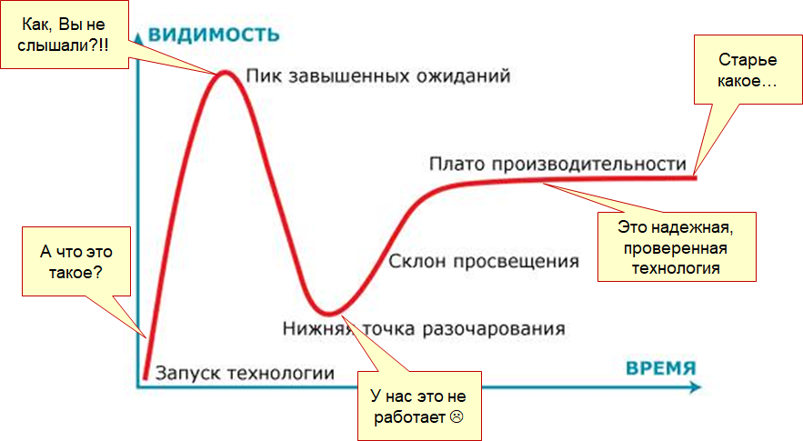
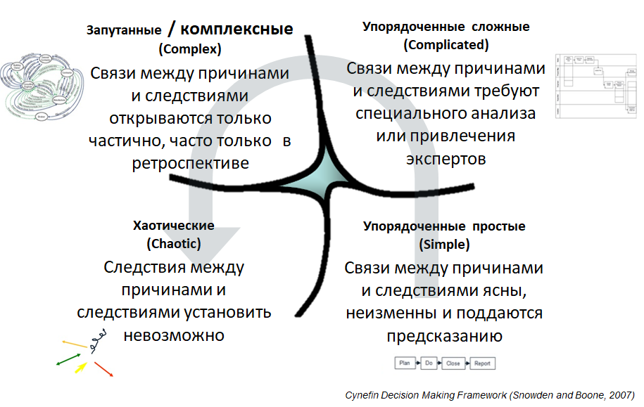
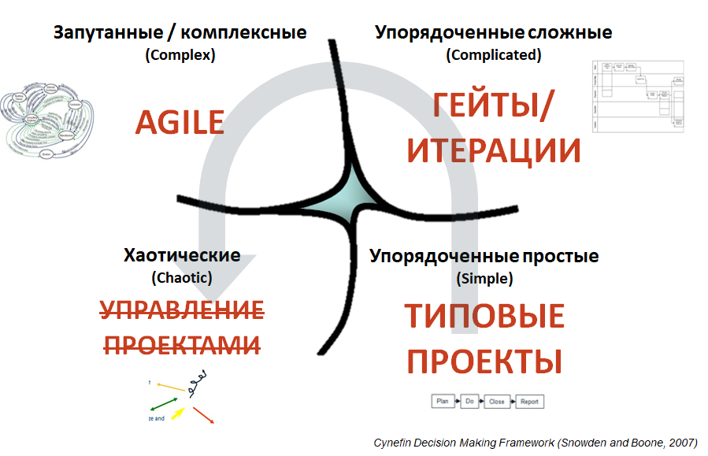

*Павел Алферов, профессор бизнес-практики*  
*Московской школы управления СКОЛКОВО*

В 2001 году очень известные разработчики IT-систем собрались вместе, чтобы
описать, как правильно создавать новые продукты в их отрасли. Результатом этой
встречи стал Agile Manifesto (<https://ru.wikipedia.org/wiki/Agile_Manifesto>),
текст которого был переведен на более чем 50 языков и получил всемирную
известность в IT-сфере. В манифесте было сформулировано 4 базовых ценности и 12
принципов работы по Agile, которые многие команды программистов “взяли на
вооружение”.

Постепенно Agile как понятие вышел далеко за границы IT-отрасли – и сейчас
многие предприниматели уже живут по Agile, едят по Agile а кто-то, возможно,
даже спит по Agile. Но такое широкое использования термина несколько запутывает,
не ясно до конца что же он означает. В самом манифесте дано достаточно
обтекаемое определение, хотя прочесть этот исторический документ безусловно
стоит.

Для нас, методологов проектного управления, Agile – это три ключевые вещи.

-   **Первое – это mindset, образ мышления**. Те установки, парадигмы, подходы,
    которые человек у себя установил, которые нацелены на постоянную быструю
    реакцию. Например: мы гибкие, готовые к любым изменениям, всегда настроены
    на все хорошее, против всего плохого. Тут личное дело каждого, какой он
    майндсет у себя в голове строит, это ближе к коучингу и психологии, и это мы
    рассматривать в данной статье не будем.

-   **Второе – это 4 базовых принципа и 12 принципов**, которые прописаны в
    Agile-манифесте, то, что можно считать философской основной Agile. Почему он
    получился таким расплывчатым? Первоначальная идея была – создать общую
    методологию разработки программных продуктов. Но создать какой-то единый и
    универсальных для всех четкий подход, общую методологию, не вышло и манифест
    – это, в чем все эти люди смогли максимально сойтись. Вспоминая свой опыт по
    разработке российских национальных стандартов проектного управления я,
    честно говоря, совершенно этому не удивлен - чем больше умных людей
    собираются в одной комнате, тем сложнее им договориться о вещах глобальных,
    философских и фундаментальных.

-   **Третья вещь – набор определенных практик**, что нужно делать, как
    правильно выстраивать работу для соответствия майндсету и принципам
    манифеста. Эти практики объединяются в группы взаимосвязанных практик
    (фреймворки). Самый известный фреймворк – и часто Agile путают именно с ним
    – это SCRUM. SCRUM – это один из способов, реализовать тот образ мышления,
    который включает 4 ценности и 12 принципов. Набор практик, которые вместе
    хорошо работают.

Вот, что такое Agile и вот в какой коннотации мы будем говорить о нем дальше.

**Американские горки продуктивности**

Любая технология или подход переживают определенные стадии своего развития – от
популярности и очарования, до бесполезности и забытья. Компания Gartner
(<https://www.gartner.com>), знаменитая своей аналитикой IT-рынка, описала эту
динамику циклами хайпа (Hype cycle <https://en.wikipedia.org/wiki/Hype_cycle>).
На русский слово “хайп” переводится плохо (Шум? Гам? Ажиотаж?), поэтому обычно
это просто так и называют, без перевода. Смысл в том, что практически все
технологии проходят определенный жизненный цикл.

-   Первая стадия – никто ничего об этой технологии не знает, но потихоньку о
    ней начинают говорить, хайп начинает расти

-   Вторая стадия – в Gartner назвали эту стадию пиком завышенных ожиданий,
    когда все узнают про технологию и ждут, что она решит все актуальные
    проблемы во всех процессах.

-   Но быстро выясняется, что новая технология работает не всегда, не везде и не
    у всех – следует разочарование (нижняя точка на графике). Кажется, что это
    просто шум, очередная пустая мода, никакого толка от нововведения не
    последует.

-   При этом на следующей стадии уже возникает понимание, где технология
    все-таки где-то применима, а кое-где и по-настоящему эффективна – склон
    просвещения.

-   И последняя стадия, следующая за пониманием – выход на плато
    производительности.

Это хорошо видно на примере блокчейна. Кто что-нибудь слышал про блокчейн и
основанный на нем биткоин лет пять назад? Практически никто и ничего. И это при
том, что технология существует с 2008 года. Два года назад любой слышал о
блокчейне – технология достигла пика завышенных ожиданий. Эксперты предвещали:
все перейдет только и исключительно на блокчейн, он полностью поменяет мир.
Похожее происходило и с появлением кино, и с появлением дополненной реальности,
интернета, электромобиля и многих других изобретений. Помните классическое:
“Вообще со временем телевидение перевернет жизнь всего человечества. Ничего не
будет. Ни кино, ни театра, ни книг, ни газет, одно сплошное телевидение!”. Тот
же цикл ажиотажа.

Все эти стадии даются предпринимателям нелегко, особенно вторая. На пике
завышенных ожиданий бизнес набирает кредиты, выходит на IPO, ожидает что все так
и будет мощно расти на волне хайпа. А на следующем этапе пузырь лопается – за
головокружительным успехом следуют головкружительные крахи и разорения. На
склоне просвещения все это вновь потихоньку развивается, но уже без былого
размаха.

Описанная стадиальность хорошо высвечивает историю с Agile. В IT Agile сейчас
где-то на выходе на плато производительности. IT-индустрия пережила свой хайп. В
бизнесе Agile сейчас, благодаря Грефу, – на пике. Любой бизнесмен что-то слышал,
пусть ничего и не понял. При этом важно не следовать за хайпом, а определить
стадию, на которой находится привлекающая вас технология или подход, – и
осознанно подступиться к ее внедрению. Ключевое слово здесь, как вы
догадываетесь, не внедрение.

**Осознанность как норма жизни**

Этому я учу своих детей, которых у меня трое. Они в каждый момент времени должны
знать ответ на два вопроса: “Что я делаю?” и “Зачем я это делаю?” Если можешь
ответить на оба этих вопроса, значит, ты совершаешь осознанные поступки. Не
можешь – задумайся. И это куда сложнее, чем кажется. Как бы вы ответили на
вопрос “Зачем внедрять новый подход у себя в компании?”

Главным именитым адептом Agile в России стал Герман Греф. Примерно три года
назад он начал говорить, что те, у кого не будет Agile в ближайшее время, умрут
в страшных муках. Сбербанк начал внедрение своего Agile-подхода, который
известен как “Сберджайл”. При этом, никто, кроме сберовских, не знает, как
выглядит Сберджайл, как именно он внедрялся и какова общая эффективность от его
применения. Узнать, это снаружи нельзя - закрытая информация. И, насколько мне
известно, в Сбербанке оценка эффективности этого подхода не проводилась.

Зачем эта история понадобилась Сбербанку? Потому что политическая воля и
позиционирование тут важнее эффективности внедрения. Возвращаясь к теме
осознанности. Герман Греф наверняка понимал, что далеко не во всех банковских
процессах возможен Agile (более того, в большинстве он как раз невозможен). Но
Сбербанк внедрял Agile, потому они хотели позиционировать себя как
инновационную, передовую ИТ-компанию, а не как традиционный и консервативный
банк. И прибив себе на флаг Agile, они убедили многих, что они если еще не
целиком, то стремительно двигаются в сторону цифровизации и технологизации. Как
итог, на глобальном уровне это было осознанно. И эта осознанность строилась на
политической и идеологической логике.

**Упорядоченность и запутанность**

Agile как система коммуникации, как принцип производства продуктов – прекрасен.
Но в определенных границах. Как у любой теории, концепции, методологии у него
есть зона наибольшей производительности, где эффект максимален, есть зона, где
эффективности не так понятна, и зона, где он вообще никак не применим. Задача в
том, чтобы понять, в какой зоне находится компания и конкретный проект
относительно этого распределения. Есть разные модели, которые помогают это
сделать. Одна из самых известных – модель «Киневин» (англ.CYNEFIN).

Идея в том, что существуют 4 основных вида систем (на самом деле пять, но мы
упростим. Для интересующихся деталями рекомендую ролик на ютьюбе с рассказом о
модели от ее автора - Дейва Сноудена. Есть даже совершенно “отрывной” вариант
объяснения на примере фильмов про зомби).

Причем модель Киневин говорит о системах в широком смысле этого термина –
система как набор элементов и связей между ними. Касательно бизнеса, проект –
это система. Подразделение – это система. Отдельная команда – это тоже система.

Какие системы описываются в модели:

-   **упорядоченные простые**, когда мы четко понимаем причину и следствие. Вот
    табуретка на 4 ножках. Отпилишь две ножки - табуретка упадет. Все понятно.
    Или велосипед - тут сидишь, тут крутиться, он едет - все понятно.

-   **упорядоченные сложные**. Условный автомобиль - система непростая, но если
    посидеть, можно разобраться самому. А еще лучше привлечь – эксперта, который
    объяснит, как все работает.

-   **запутанные или комплексные**. Допустим, перед вами – лягушка. Когда мы ее
    тыкаем палочкой, у нее дергается лапка. От чего дергается, непонятно. Ну то
    есть понятно, но не очень. Если мы будем долго разбираться, то в конце
    концов как-то поймем, но не все и не до конца - наука вот до сих пор
    разбирается с деталями и особенностями функционирования нервной системы. Как
    разберется будут нейроинтерфейсы дистанционного управления лягушкой. И
    перейдет это в класс упорядоченных сложных систем.

-   **хаотические**. Что бы мы ни делали – все равно непонятно. Хаос он и есть
    хаос.

Представим, что нам нужно выпустить какое-то издание к предстоящей конференции.
Если у вас налажено – есть коллектив авторов, налажены все эти процессы печати,
– то это простая история.

Но если мы никогда не занимались издательством и публикациями? Понятно, что это
сложная система, но мы проанализировали этапы и привлекли экспертов, которые
сказали, как нужно сделать. Как они сказали, так мы и сделаем.

Выйдем на новый уровень. Давайте выпустим журнал с использованием виртуальной
реальности, для тех, например, у кого есть очки дополненной реальности. Они
смогут в 3D как-то взаимодействовать с этими статьями. Понятно, что технически
это можно сделать, но совершенно непонятно, как все это будет работать и нужно
ли оно кому-то. Это как раз и есть сфера Agile, когда нам нужно
экспериментировать, а экспертов мы позвать не можем, потому что их просто нет.
Никто этого не делал до нас.

Тогда мы проводим небольшие эксперименты - и быстро выкатываем продукт, который
нам удается собрать на свой страх и риск. Такой продукт в Agile называется MVP
сокращение от английского minimal viable product - Минимально жизнеспособный
продукт. По непонятным причинам сокращение МЖП в русском языке не прижилось -
все называют MVP.

Так как это MVP быстро оказывается на рынке, то есть шанс быстро протестировать
насколько он решает проблемы целевой аудитории, получить обратную связь от
пользователей – это позволит нам исправить и доработать продукт в дальнейшем,
экономя средства на запуск и доработку первых этапов.

Вот как раз для таких запутанных (комплексных) историй Agile и подходит лучше
всего.

**Стоит / не стоит. О целесообразности**

Когда мы с коллегами разрабатывали Методические рекомендации по применению Agile
в госорганах мы сформулировали когда стоит, а когда не стоит применять Agile. И
эти рекомендации универсальны, подходят и для бизнеса и для некоммерческих
организаций. Для всех.

Итак когда целесообразно применять Agile:

-   **Высокая неопределенность**. Задача должна быть решена в условиях высокой
    неопределенности. Нужно найти решение и нет возможности заранее определить
    как конкретно будет реализовываться задача, какой конкретно продукт должен
    быть получен в итоге

-   **Меняющиеся требования и условия реализации**. В ситуации, когда требования
    к создаваемому продукту по каким-либо причинам существенно меняются в
    процессе его создания или меняются внешние обстоятельства. Agile-подход дает
    необходимый инструментарий для оперативного управления изменениями и
    итеративного достижения требуемого результата

-   **Требуется постоянная демонстрация успехов.** Необходимо регулярно
    показывать руководству и заказчикам работающий продукт

Когда же его использовать нецелесообразно:

-   **Невозможно менять созданный продукт**. Если есть технологические,
    инфраструктурные, политические барьеры, препятствующие постепенному выпуску
    продукта путем поэтапного его улучшения

-   **Куратор проекта не готов финансировать доработки**. Изменения и
    многочисленные доработки продукта могут значительно увеличить стоимость
    разработки и сделать Agile-подход неприемлемо дорогим (экономически не
    оправданным). Вообще как показывает практика Agile может значительно
    ускорить разработку продукта (показатель time-to-market, время выхода на
    рынок), но стоит это дорого. Сравнимо, а то и дороже классического подхода.

-   **Высока цена ошибки**. Если нет возможности быстро, регулярно и безопасно
    демонстрировать создаваемые версии продукта (инкременты). То есть если
    каждый выпуск без исчерпывающих проверок несет существенные риски
    финансового, имиджевого характера или риски безопасности. Если от наших
    экспериментов кто-то умрет это будет очень неудачный MVP.

-   **Высокая предсказуемость.** Условия реализации проекта стабильны,
    требования к продукту незначительно меняются и известны заранее, проект
    носит “типовой” характер, у команды есть опыт реализации таких проектов и
    нет ценности в получении результата проекта частями в короткие сроки

**Чек-лист готовности**

Если вы проанализировали ситуацию и пришли к выводу, что Agile подходит для
вашей компании, вашего проекта, остается решающий и самый сложный этап: оценить,
готовы ли вы сами и ваша команда к новой организации процессов. Может оказаться,
что ситуация очень даже способствует применению Agile, а вот люди не могут
сейчас адекватно использовать нововведения. Причем люди, это не только команда,
но и само руководство, заказчик.

Вот что нужно проверить:

-   **Команда и стейкхолдеры готовы принять ценности и принципы Agile-подхода.**
    Ценности, принципы и правила прописаны в манифесте и в множестве книг и
    статей. Из всех них самой сложное для нашей ментальности - “право на
    ошибку”. Ведь для неопределенности, запутанности ошибки - это нормально.
    Аgile – это и есть институционализированный метод проб и ошибок,
    эксперимента. Важно что-то сделать, потом смотрим, что получается, что нет –
    и быстро переделываем. Тут работает принцип: “ошибайся быстро, ошибайся
    безопасно” (англ. Fail fast, fail safe). Неважно, что ошибся. Важно, что
    ошибку обнаружили, распознали и быстро исправили. Это один из очень
    серьезных барьеров на пути внедрения Agile в России, в которой еще со
    сталинских времен в голове у многих осталось восприятие в духе “У каждой
    аварии есть имя, фамилия и отчество”. Если команда сделала что-то
    неправильно, не должно быть “расстрелов”.

-   **Есть возможность собрать Agile-команду.** А Agile-команда это непростая
    команда. В ней должны сочетаться ряд характеристик:

    -   Она должна быть компактная ( 7 +/- 2 человека) - еще называют “2 pizza
        team” - команда которую можно накормить двумя пиццами. То есть совсем
        небольшая. Техники масштабирования Agile на большие команды существуют,
        но они очень и очень нетривиальны. Начинать с них точно не стоит,
        сначала нужно отработать на небольших командах.

    -   Включать сотрудников обладающих всеми компетенциями, необходимыми для
        разработки продукта и представляющих все подразделения, которые
        необходимы для разработки продукта.

    -   У сотрудников должно быть достаточно времени для работы в команде.
        Крайне желательно, чтобы они все свое время посвящали работе над
        проектом (принцип “100 на 0” то есть 100% вовлечения).

    -   Все должны сидеть вместе, в одном помещении (не обязательно, но крайне
        желательно)

    -   И, очень важно, команда должна быть готова принять на себя
        ответственность. А ведь наши сотрудники ох как не любят брать на себя
        ответственность. В моих опросах руководства компаний это одна из самых
        часто упоминаемых проблем.

-   **Есть Владелец продукта (Заказчик),** который:

    -   уполномочен единолично определять все требования к продукту и
        приоритетность задач. Тоже очень больной вопрос. В нашей российской
        “Византийской системе управления” получить такое право зачастую очень не
        просто. Я писал об этом в своей предыдущей статье.

    -   доступен для команды. Готов все обсуждать и рассматривать вопросы по
        продукту в том же темпе, в котором работает команда. Если команда
        отработала спринт (например, две недели), а потом месяц ждет возможности
        поговорить с Владельцем, – схема не сработает. Он должен быть готов
        оперативно выделять время на обратную связь и на уточнение вопросов по
        сути реализуемых задач;

    -   доверяет команде. Владелец продукта определяет “что делать”, команда
        определяет “как делать”. И Владелец не лезет в то, как команда решает
        задачи, которые он поставил. Аgile – не синоним хаоса, нельзя в середине
        спринта влезть в командный процесс со словами “не так вы работу
        работаете, я сейчас разъясню вам как надо” или “давайте вот это отложим
        и лучше сделаем вот это”. Agile не приемлет микроменеджмент. Это
        концептуально не сочетающиеся вещи.

-   **Высшее руководство подтвердило свою поддержку.** Высшее руководство, те
    кто стоит над командой и над Владельцем продукта, подтвердили, что они
    готовы оперативно рассматривать и принимать решения по эскалированным на них
    вопросам. По тем вопросам, которые команда не сможет решить на своем уровне.
    А таких вопросов точно будет много. Особенно в начале.

-   **Согласованы накладываемые на проект ограничения.** Между командой и
    ключевыми заинтересованными сторонами достигнуты договоренности по
    критическим ограничениям: сроку, бюджету, ресурсам и др. Заинтересованные
    стороны документально зафиксировали свои требования по ограничениям, команда
    их приняла.

**Итог. Ежи, ужи и гибриды**

Вернемся к началу нашего разговора. Любой подход может быть по-своему эффективен
- ничто ни хорошо и не плохо само по себе, все зависит от обстоятельств.

Agile доказал свою эффективность уже не в одной индустрии. Практики Agile
используются в российском центробанке и на металлургических заводах, при
цифровизации нефтянки и в НИОКРах фармацевтических компаний. Есть даже кейс
когда по Agile проектировали атомную электростанцию.

Но мера этой эффективности не всегда следует из его популярности, хайпа, который
поднимается вокруг новации. Даже наоборот - максимальная эффективность
достигается часто уже после того, как волна первого воодушевления спадает. Когда
возникает понимание что работает, что не работает. И как именно оно работает и в
каких условиях оно не работает.

Любое нововведение должно быть осознанным решением: нужно четко понимать, зачем
вы хотите Agile, какой результат ожидается и какими затратами это может
сопровождаться.

Ну и необходимо проверить, насколько готова команда, включая руководство, к тем
изменениям, которые планируются. Приведенный выше чеклист может в этом помочь.

И, последнее, самое важное, - нельзя останавливаться. Нельзя внедрить и жить с
этим. Надо искать и экспериментировать. Постоянно развивать используемые
практики. Сейчас начинает набирать силу следующая волна - гибридных подходов.
Объединения “ежа и ужа” - классических и Agile подходов. Это обещает быть
интересным. И конечно у них тоже будут свои границы применимости - не забывайте
включать осознанность!
