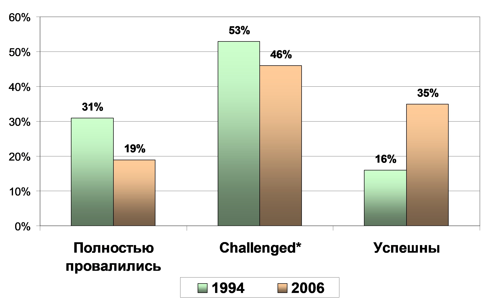
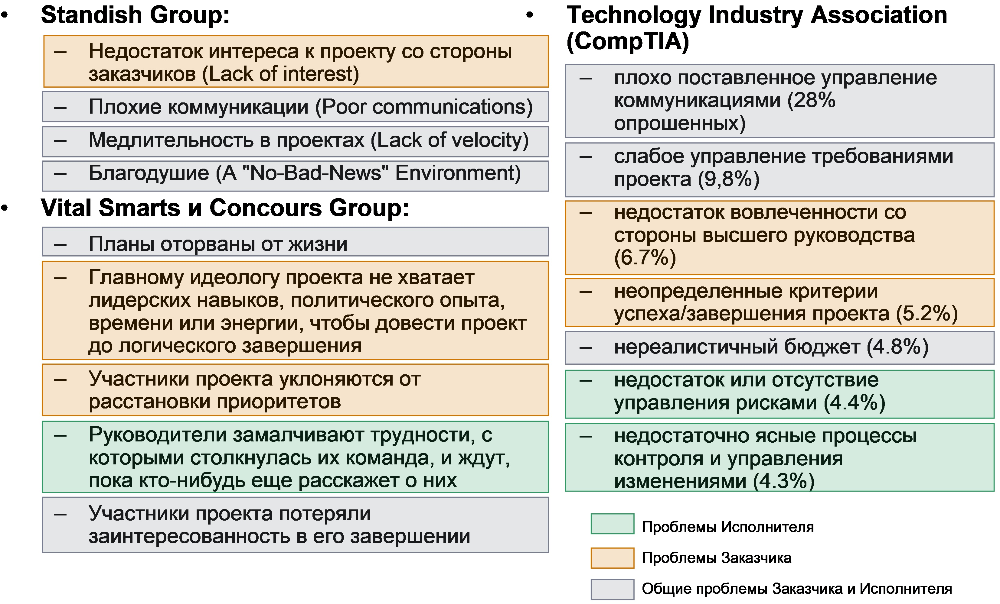
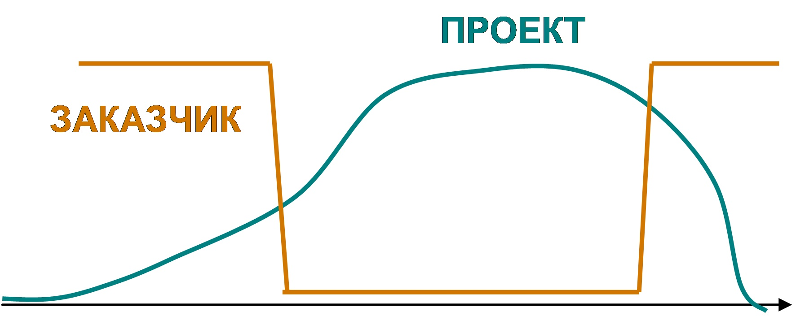
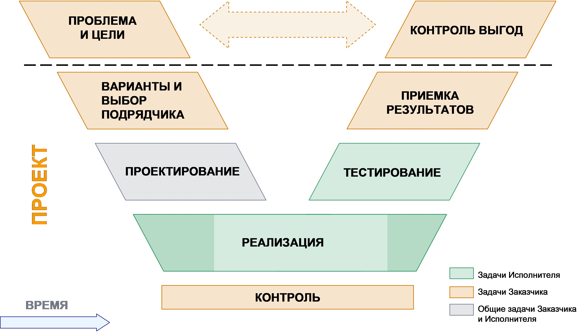

<paalferov@gmail.com>

Введение
========
*«Нужно писать только те книги, от отсутствия которых страдаешь.*

*Короче : свои настольные.» Марина Цветаева*

Среди обширной литературы посвященной проектному управлению только небольшая
часть ориентирована на Заказчика, объясняет его роль и обязанности в проекте.
Отсутствие формального или хотя бы полу- формального описания данной роли
осложняет как работу проектного менеджера, так и работу Заказчика. Данная статья
не претендует на полное раскрытие темы, но является некоей попыткой обобщить и
выделить на основе реального опыта основные элементы роли бизнес Заказчика для
проектов разработки и внедрения сложных ИТ систем.

Заказчик и проектный менеджер

*"Любое знание можно передать знаково-логистическими средствами, сконструировав
и сообщив мысль в соответствующей языковой конструкции средствами конструкции,
предполагая, что любой человек в точке передаваемого знания может воссоздать
предмет, к которому оно относится, и убедиться на опыте в смысле передаваемого
знания." (Виктор Бойко «Йога: искусство коммуникации»).*

Получить представление о том, как Заказчик воспринимает терминологию проектного
менеджера можно попытавшись прочитать и осмыслить приведенную цитату. Потеряв
некоторое количество времени на вдумчивое прочтение можно догадаться, что это
всего-навсего описание процесса коммуникации.

Примерно так же странно для несведущего в проектном управлении человека
(Заказчика) звучат слова об определении содержания, качественной оценке рисков и
структурной декомпозиции работ. Когда к профессиональной терминологии
добавляется локальный жаргон ситуация усугубляется. При этом появляются такие
эффектные фразы как: «Эта фича не входит в скоуп моего проекта, поэтому является
риском и должна быть митигирована».

К сожалению, курсы по проектному управлению не полностью решают данную проблему,
поскольку во-первых в основном нацелены на людей профессионально вовлеченных в
управление проектами, во-вторых чаще всего дают общее представление об
управлении проектами. Это представление сложно приложить к проектам идущим
«здесь и сейчас», к проектам которые в большинстве своем далеко не соответствуют
«книжным» стандартам. Соответственно не обладая большим проектным опытом не
профессионалу сложно выделить, что является критически важным для него на
проекте, а без чего можно обойтись. Например, составление плана коммуникаций для
проектов средней сложности не является строго необходимым, а вот проект, в
котором четко не зафиксированы цели и ожидаемые результаты, назвать полноценным
уже определенно нельзя.

Кроме того, необходимо отметить, что роль Заказчика возникает еще до старта
проекта (определение потребностей, формулировка целей проекта) и от того
насколько успешно будет проделана эта предварительная работа очень во многом
зависит успех или провал всего проекта.

Для ИТ проектов ситуация обостряется тем, что вышеупомянутые сложности
накладывается на сложность информационных технологий как предметной области. Все
перечисленные факторы вместе приводят к возникновению серьезных проблем при
выполнении ИТ проектов.

Проблемы ИТ проектов
====================

*Как выходит, что проект опаздывает на год? Постепенно...*

*Фредерик Брукс*

Существует обширная статистика по неудачам и проблемам ИТ проектов. Данному
предмету посвящено большое количество книг, статей и аналитических исследований.

Наиболее крупные и известные примеры провалов:

-   После того как компания *Oxford Health Plans* объявила о том, что трудности
    с ПО привели к многочисленным ошибкам при составлении счетов и обработке
    заявок, ее рыночная капитализация за один день упала на \$3 млрд.

-   Потери компании *Nike*, вызванные трудностями в установке программного
    обеспечения для системы снабжения и распределения, составили \$400 млн.

-   *ФБР* в 2005 году вынуждена была закрыть проект *Virtual Case File*  
    *(VCF),* на который за 5 лет было потрачено \$ 170 млн.

-   FoxMeyer была одним из ведущих дистрибьюторов лекарств в мире. Оборот 5,5
    млрд. долларов в год (четвертое место в США). После неудачного внедрения ERP
    системы (новая система сбоила и работала раз в 40 медленнее старой) многие
    заказчики ушли к конкурентам FoxMeyer,  
    розничная сеть дистрибутора развалилась, и он оказался в состоянии
    банкротства

-   В марте 2008 года компания Waste Management подала в суд на SAP AG обвинив
    ее в потере 100 млн.\$ из-за неудачного внедрения ERP системы

-   На открытом 27 марта 2008 года сверхсовременном пассажирском терминале-5
    аэропорта Хитроу возник критический сбой в системе обработки багажа,
    повлекший за собой многодневный хаос. British Airways, отменила более 450
    рейсов за четыре дня. В терминале скопилось более 15 тыс. единиц багажа, не
    полученного пассажирами. Только прямые потери составили больше 40 млн.\$

Вообще данные проблемы интернациональны и не являются прерогативой только
иностранных корпораций. В последнее время появилось довольно много публикаций о
проблемах и на выполняемых в России проектах. Например, проблемное внедрение
Oracle Applications в компании «36.6», неудачное внедрение 1С в компании
«Формула безопасности», эпопея системы ЕГАИС и другие.

Для интересующихся данной информацией могу порекомендовать ресурс полностью
посвященный провалам ИТ проектов:
[www.projectfailures.com](http://www.projectfailures.com).

Наиболее известным обобщающим исследованием по вопросам неудач ИТ проектов
является обзор «The Chaos report» от The Standish Group , в котором на
протяжении уже 15 лет отслеживается статистика по коммерческим и государственным
проектам и программам.

Как можно видеть из приведенных цифр, в общей статистике наблюдается
положительная динамика - за 12 лет количество провальных проектов сократилось на
12%, количество успешных увеличилось на 19%. Тем не менее, ситуацию сложно
назвать нормальной и индустрии еще предстоит большая работа над улучшением
ситуации.

Причины проблем

*У каждой аварии есть фамилия, имя и отчество!*

*Сталинский нарком железных дорог*  
*Л.М. Каганович*

В большинстве исследований проводится анализ причин возникновения проблем на
проектах. На рисунке приведен список причин из трех исследований:

-   уже упоминавшийся обзор Standish Group 2006 года

-   исследование 2007 года по 2200 проектам от консультантов Vital Smarts и
    Concours Group

-   опрос, также проведенный в 2007 году ассоциацией Computing Technology
    Industry Association (CompTIA) среди примерно 1000 респондентов

Если провести классификацию указанных проблем с точки зрения кто же является их
первопричиной: Заказчик или Подрядчик, то можно увидеть, что большая часть
связана именно с недоработками на стороне Заказчика или, как минимум, это общие
проблемы и Заказчика и Исполнителя. Несмотря на некоторую условность такого
обобщения, практический опыт автора подтверждает этот вывод.

Роль заказчика в «идеальном» мире
=================================

*Все нужное человеку - просто, все сложное - не нужно*

*Лев Толстой*

В первом приближении в «идеальном мире» роль бизнес-заказчика для любого проекта
(не обязательно ИТ) можно описать пятью основными задачами:

1.  Понять проблему, которую должен решить проект. Определить цели, ожидаемые
    результаты проекта (Deliverables) и требования к ним

2.  Выбрать Исполнителя и объяснить ему задачу

3.  Выделить Исполнителю ресурсы (если необходимо) и полномочия (если не
    хватает)

4.  Принять от Исполнителя результаты проекта

5.  Использовать полученные результаты в своей деятельности

Несколько утрируя можно отразить это в виде следующей схемы:

Например, для проекта внедрения ERP системы в таком «идеальном мире» роль
Заказчика можно представить следующим образом:

1.  Проблемой являются большие остатки на складах. Для решения данной проблемы
    нужно внедрить модуль учета складских остатков ERP системы. На основе
    информации из ERP системы можно будет провести оптимизацию процессов и
    уменьшить объем остатков (выгоды). Целью проекта будет внедрение складского
    модуля[^1]. Результаты: настроенный модуль, обученные пользователи,
    разработанная проектная и эксплуатационная документация, внедренные
    изменения в бизнес-процессах. Требования к данным результатам детализируются
    в виде «Технического задания»(ТЗ) или «Запроса на предоставление
    коммерческого предложения»(RFP)

    [^1]: Распространенной (и во многом правильной, хотя и сложно реализуемой)
    точкой зрения является установка в качестве цели проекта именно снижения
    остатков. Но при этом надо понимать, что такой подход потребует значительно
    больше времени, чем непосредственно само внедрение и повлечет за собой
    несколько другую организацию и самих работ и проектной команды. Также надо
    принять во внимание, что согласно исследованиям чем длиннее проект, тем
    меньше у него шансов на успешное завершение. В приведенном же случае ИТ
    проект дает бизнесу инструмент для проведения оптимизации. Использование
    инструмента может осуществляться или в рамках обычной операционной
    деятельности или в рамках отдельного бизнес-проекта

2.  Для выбора Исполнителя проводится тендер, на который выставляется ТЗ или RFP

3.  Исполнителю выделяются финансовые и человеческие ресурсы (в виде ключевых
    пользователей)

>   *… и на этом Заказчик очень часто считает свою работу выполненной,
>   соответственно ожидает через некоторое время получить…*

1.  Работающую систему, функционирующие процессы и проч.

2.  Далее Заказчик, опираясь на данные, предоставляемые системой будет проводить
    анализ и получать заявленные выгоды в виде сокращения остатков

Как известно любому, кто имел отношение к внедрению ERP систем, эта простая и
понятная схема практически никогда не работает. Она не работает в ERP проектах,
она не работает в консалтинговых проектах и с особенно страшной силой она не
работает в проектах заказной разработки программного обеспечения.

Причиной этого является «не идеальность» нашего мира в целом и российского ИТ
рынка в частности.

Роль Заказчика в «реальном» мире
================================

*Больше всего в этом нашем мире тревожит не то, что он неразумен, и даже не то,
что он разумен. Чаще всего нас тревожит то, что он почти разумен, но не совсем.
Жизнь не алогична; однако сама она является ловушкой для логичного человека. Она
выглядит немного более логичной и правильной, чем есть на самом деле; ее
правильность очевидна, а ее неправильность скрыта;*  
*ее хаотичность подстерегает нас…*

*Гилберт Кит Честертон*

В качестве основных факторов, не позволяющих работать модели «идеального мира»
можно привести следующие.

**1 . «Не идеальность» исполнителя**

Этот фактор может проявляться различными способами:

-   Подрядчик может не правильно понять задачу

-   Подрядчик может не иметь ресурсов для выполнения проекта

-   Подрядчик может иметь ресурсы для выполнения проекта при запуске проекта, но
    потом перебросить их на более выгодный проект

-   Подрядчик может в целях экономии использовать неквалифицированные ресурсы
    для выполнения работы

-   Подрядчик может в целях экономии руководствоваться минимальными стандартами
    качества для выполняемых работ

-   И так далее…

Данный список можно продолжить. По каждому элементу списка я могу привести
практический жизненный пример, когда именно таким образом Подрядчик и поступал.

Соответственно основной вывод состоит в том, что даже в самом лучшем случае
работа подрядчика требует **контроля**. Степень контроля и его глубина
определяются различными факторами, но без контроля обойтись нельзя. Кроме того
очевидно, что выбор Исполнителя является одним из критических моментов всего
проекта.

К сожалению, необходимость контроля вообще является одной из черт российской
действительности лучше всего отраженной в высказанной еще сто лет тому назад
фразе: «У нас в России все только людьми можно сделать и всякое дело надобно
держать, не отпуская ни на минуту: как только отпустишь его в той мысли, что все
идет само собой, так дело разоряется и люди распускаются и расходятся»
(обер-прокурор Синода К.Победоносцев)

**2. Отсутствие единства в организации Заказчике**

В любой сколько-нибудь крупной организации не возможно выделить единственное
лицо, которое можно в полной мере назвать Заказчиком. Фактически роль Заказчика
распадается на несколько уровней:

-   Акционеры (для крупных проектов)

-   Топ-менеджмент

-   Мидл-менеджмент

-   Ключевые пользователи

-   Конечные пользователи

На каждом из этих уровней существует свое понимание проекта, реализуются свои
задачи и принимаются во внимание свои интересы.

**3. Сложность создаваемых и внедряемых ИТ систем**

Это особенность не только «реального мира» вообще, но именно предметной области
информационных технологий. Данная проблематика подробно освещена в большом
количестве статей и книг. Но раньше всех и, на мой взгляд, лучше всех об этом
было написано в классической книге Фредерика Брукса «Мифический человеко-месяц»:
Сложность программных объектов более зависит от их размеров, чем, возможно, для
любых других создаваемых человеком конструкций, поскольку никакие две их части
не схожи между собой (по крайней мере, выше уровня операторов). Если они схожи,
то мы объединяем их в одну подпрограмму, открытую или закрытую. В этом отношении
программные системы имеют глубокое отличие от компьютеров, домов и автомобилей,
где повторяющиеся элементы имеются в изобилии.

Сами цифровые компьютеры сложнее, чем большинство изготавливаемых людьми

вещей. Число их состояний очень велико, поэтому их трудно понимать, описывать и

тестировать. У программных систем число возможных состояний на порядки величин

превышает число состояний компьютеров.»

За прошедшие несколько десятилетий указанные сложности так и небыли преодолены.
На вызов сложности больших ИТ систем пока не найдено другого ответа кроме
расстановки приоритетов в первоначальных требованиях, итеративной разработки и
постепенного уточнения желаемых результатов. Данный подход неминуемо приводит к
необходимости плотно привлекать Заказчика по всему ходу проекта. При этом
Заказчику приходится принимать принципиальные решения как по требованиям к
системе, так и по вопросам, связанным с организацией выполнения проекта.

Хотя список факторов далеко не полон, можно подвести некоторые итоги.

Обобщая роль Заказчика ИТ систем в «реальном мире» можно определить следующим
образом. Заказчик должен:

1.  Понять проблему, определить цель, ожидаемые результаты и выгоды,
    существующие ограничения (бюджет, сроки и т.д.)

2.  Разделить роль Заказчика (делегировать полномочия)

3.  Определить требования и приоритеты (срок, функционал, бюджет, качество,
    важность результатов)

4.  Определить варианты решений

5.  Выбрать Исполнителя, корректно поставить задачу официально предоставить
    полномочия

6.  Выделить ресурсы, в том числе время сотрудников Заказчика, на каждом уровне

7.  Контролировать проект

8.  Принимать принципиальные решения с учетом целей проекта

9.  Осуществить приемку результатов

10. Проконтролировать что результаты приносят заявленные выгоды

Графически Роль Заказчика ИТ систем можно представить следующим образом

В большинстве западных компаний и в некоторых российских важность формализации
роли Заказчика вполне осознана и созданы соответствующие процессы (CVP для
ТНК-ВР, G5 для Альфа-групп и т.д.). Эти процессы позволяют расширить и дополнить
стандарты проектного управления путем более глубокой интеграции со структурой
компании и могут являться основой для развития проектного подхода в тех
компаниях, которые находятся на начальных этапах внедрения процессов и методов
управления проектами.

Практические рекомендации 
==========================

*Глуп тот, кто учится на своем опыте, я предпочитаю учиться у других и избегать
расплаты за свои ошибки*

*Отто фон Бисмарк*

Основываясь на изложенной модели можно сформулировать ряд простых рекомендаций
для компаний, которые пока не создали у себя подобного процесса, или (тем более)
не внедрили хотя бы базовые принципы проектного управления.

**1. Определите кому конкретно и зачем нужен проект**

Перед запуском проекта зафиксируйте в отдельном документе (его можно назвать
Уставом проекта, Паспортом проекта или Запросом на проект) несколько основных
моментов:

-   **Проблему**, которую Вы решаете. Зачем мы запускаем проект? Является ли
    проблема достаточно серьезной, чтобы тратить время и ресурсы на ее решение?

-   **Цели** проекта и ожидаемые результаты. Как мы видим себе выход проекта?
    Что мы получим в результате его выполнения?

-   Какие **выгоды** принесут данные результаты. Являются ли данные выгоды
    решением проблемы? Достаточны ли они?

-   Ваши **ограничения** (бюджет, сроки, ресурсы)

-   Каковы **приоритеты** в проекте.

ГЛАВНЫЙ ВОПРОС: А есть ли человек/подразделение которому действительно нужен
этот проект? Готов ли он его отстаивать?

Это необходимо сделать до того, как вы привлечете Исполнителя.

**2. Распределите ответственность**

В рамках проектной команды со стороны Заказчика стоит выделить как минимум две
роли.

Во-первых, необходимо определить, кто будет осуществлять **стратегическое**
управление проектом: определять цели и проритеты проекта, обеспечивать проект
ресурсами, разрешать конфликтные ситуации и т.д. Это может быть отдельное лицо
(Спонсор, Заказчик, Куратор, Владелец проекта) или коллективный орган
(Управляющий Комитет, Управляющий Совет).

Во-вторых необходимо определить кто будет осуществлять непосредственное
**тактическое** управление проектом: определять требования к результатам,
ставить задачи рабочей группе, контролировать подрядчика (Ответственный за
проект, Лидер проекта, Менеджер проекта от Заказчика). Очень желательно, что бы
это было одно лицо

Принципиально важно, что Владелец проекта не должен быть тем же лицом, что и
Ответственный – у них разные роли и разная вовлеченность в проект. Владелец,
чтобы выполнять свои функции, должен занимать достаточно высокое положение в
иерархии организации. Обычно у таких людей просто физически нет времени для
непосредственного руководства проектом. Кроме того, их отстраненность от
проектной «текучки» позволяет принимать более взвешенные стратегические решения.

**3. Серьезно отнеситесь к выбору Исполнителя:**

Как уже было сказано выше, выбор исполнителя является одним из критических
моментов. На эту тему существует большой объем литературы, в том числе обширные
разделы по конкурсным закупкам в российском законодательстве.

Выделю ключевые, с моей точки зрения, моменты

1.  Заранее определите экспертную группу для оценки предложений и роли в ней

2.  Определите критерии выбора (взаимно не исключающие и не дублирующие
    друг-друга) и процедуру его утверждения

3.  Подготовьте документ RFP (Request for proposal,  
    Запрос на коммерческое предложения), включающий:

    -   Состав работы подрядчика

    -   Требования к результатам работы (к внедряемой системе)

    -   Требования по срокам и стоимости проекта

    -   Требования к ведению проекта

    -   Предоставляемые подрядчиком на тендер материалы

    -   Информацию о принципах выбора подрядчика

4.  Тщательно проанализируйте присланные предложения на предмет соответствия
    Вашему RFP. Подрядчики любят «забывать» неприятные для них вещи. Смотрите на
    резюме предлагаемых членов проектной команды. Для критичных и сложных
    проектов имеет смысл предварительно встретится с предлагаемым менеджером
    проекта со стороны Исполнителя и оценить его адекватность.  
    (особенное внимание обратите на резюме проектного менеджера)

5.  Внимательно проработайте договор (обязанности сторон, оплаты, правила
    приемки работ, штрафные санкции, интеллектуальная собственность)

**4. Контроль процесса и результатов**

Осуществление контроля за ходом проекта со стороны подрядчика может являться
темой отдельной обширной статьи. Обратите внимание, вопрос не в контроле проекта
со стороны проектного менеджера (это является составной частью практически всех
существующих методологий проектного управления), имеется ввиду контроль за
проектом вне самого проекта. Фактически контроль самого проектного менеджера.

Итак, какие есть основные особенности контроля за ходом проекта со стороны
Заказчика?

Такой контроль должен быть *системным*. Единоразовые нескоординированные
мероприятия мало что дадут. Должна быть построена система контроля.

Чтобы построить такую систему Вам необходимо ответить на три основных вопроса:

1.  С чем сравнивать?

2.  Какие инструменты контроля использовать?

3.  Как глубоко смотреть?

По первому вопросу. Контроль это всегда сравнение с некоторым эталоном. Нужно
определить что Вы берете за эталон. Каких-либо единых общих для всех стандартов
по выполнению ИТ проектов не существует, все носят рекомендательный характер.
Это несколько осложняет достижение договоренности с подрядчиком что мы понимаем
под «нормальным управлением проектом». Международные стандарты (от PMI, IPMA и
т.д.) к сожалению слишком обширны и не выделяют минимальные критические
требования к проекту.

Тем не менее на основе этих стандартов и здравого смысла можно сформулировать,
что для проекта любого размера, который хочет называться проектом должны быть:

-   Цели - утвержденные

-   План работ - утвержденный, фактический, прогноз

-   Бюджет - утвержденный, фактический, прогноз

-   Описание оргструктуры проекта с распределением ответственности –
    утвержденное

-   Описание результата проекта - утвержденное (может называться «Техническое
    задание», «Спецификация» или как-то иначе)

-   Периодические отчеты по ходу проекта, включающие анализ основных рисков

-   Документы, подтверждающие принятые на проекте решения (подписанные проектные
    документы, акты, протоколы встреч). В бумажном или электронном виде, в
    зависимости от культуры организации

После того, как Вы определили что будете контролировать, необходимо определиться
с тем, какие инструменты контроля Вы хотите использовать. Основные инструменты
контроля процесса (в порядке убывания степени формальности):

-   Аудиты

-   Точки принятия решений (Ворота)

-   Экспертные отчеты (peer reviews)

-   Отчеты проекта

-   Собрания

-   Встречи один на один

Каждый из этих инструментов имеет свои плюсы и минусы и свою сферу применимости.

Третьим вопросом, ответ на который необходим для построения полноценной системы
контроля является понимание глубины предполагаемого контроля (Можно сказать, что
ГЛУБИНА = ЧАСТОТА x ОБЪЕМ ИНФОРМАЦИИ). Необходимо учитывать, что любой контроль
требует затрат как того кого контролируют, так и того кто контролирует. Чем
больше глубина контроля, тем выше трудозатраты. И вообще мало что так раздражает
работающего человека как постоянный мелочный контроль.

**5. Последнее**

Возможно этот пункт стоит определить как наиболее важный.

Критически важно, чтобы обе стороны придерживались согласованного плана и
выполняли взятые на себя обязательства. Формулировка «мы им платим деньги, пусть
они и работают» первый большой шаг к провалу. Внедрение сложной системы требует
**обязательного** плотного взаимодействия между Заказчиком и Исполнителем работ.
Их взаимного терпения, уважения и взаимопонимания.
