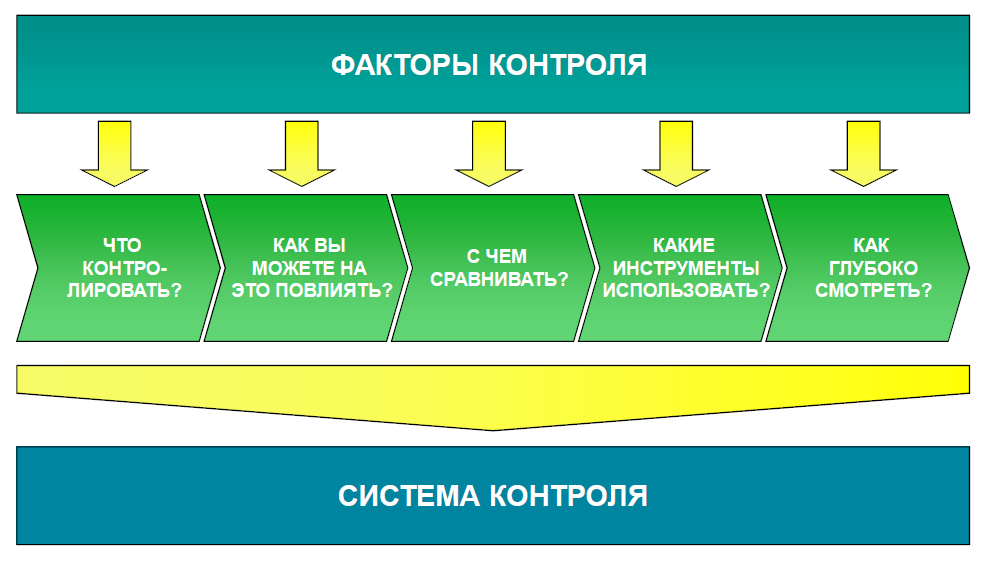

Руководил департаментом знаний, информации и методологии АНО «Оргкомитет Сочи –
2014». Занимался внедрением проектного управления в ТНК-BP, Альфа-групп, X5
Retail group, НИПК «Электрон». Один из разработчиков национальных стандартов
проектного и портфельного управления. Член Экспертного совета по внедрению УП
при Минэкономразвития. Член экспертной сети МОК. Член Совета itSMF Россия. Один
из авторов учебника для ИТ-директоров. Преподаватель Школы ИТ менеджмента РАНХ.

>   У нас в России все только людьми можно сделать и всякое дело надо держать,
>   не отпуская ни на минуту: как только отпустишь его в той мысли, что все идет
>   само собой, то дело разоряется и люди распускаются и расходятся.  
>   *Обер-прокурор Синода К.П. Победоносцев, конец XIX века*

Контроль проекта проектным менеджером – часть всех существующих стандартов
управления проектами. Но нужен ли еще один уровень контроля – контроль самого
проектного менеджера и выполняемого им проекта? В идеальном мире контроль за
проектным менеджером не нужен: проектный менеджер сам зафиксирует проблемы и
открытые вопросы, определит круг заинтересованных лиц, передаст им нужную
информацию и организует разрешение проблем наилучшим образом. Но так как наш мир
не идеален, то у многих участников проекта возникает насущная необходимость
самим держать все под контролем. Прежде всего, это относится к топ-менеджерам
компании, которые, как правило, сами не управляют проектами, но обязаны
контролировать идущие проекты.

### Зачем нужен контроль проектов?

Начнем с примера.

>   *Зима 200.. года. Проект создания центра обработки данных (ЦОД) в одном из
>   регионов. Очередная проверка показала, что по новому прогнозу отставание от
>   графика составляет уже 10 месяцев. Бюджет проекта превышает сумму,
>   заложенную на этот год на 400 тыс. долл..*

>   *Детальное разбирательство выявило печальные факты:*

-   *у проектного менеджера нет актуального плана работ;*

-   *проектные документы не соответствуют заключенным контрактам;*

-   *перенос работ с предыдущего года не был оформлен соответствующим образом;*

-   *несмотря на наличие большого количества вопросов и проблем, Управляющий
    комитет проекта не собирался с осени, его члены не информировались о
    состоянии дел;*

-   *методология управления проектами компании не соблюдается. Необходимые
    документы не были подготовлены и подписаны;*

-   *Несмотря на большое количество изменений в объеме, бюджете и сроках
    проекта, ни одного запроса на изменение подготовлено не было.*

Ситуации, подобные изложенной, в российской действительности возникают весьма и
весьма часто. Значительно чаще, чем хотелось бы и на порядок чаще, чем могло бы
быть при использовании даже простейшей системы контроля.

Контроль – это одна из основных функций менеджмента наряду с планированием,
анализом и мотивацией. Основная цель контроля – понимание текущей ситуации,
снижение неопределенности, повышение уверенности в благополучном исходе и
своевременное принятие управленческого корректирующего воздействия. Причем чем
меньше понимание ситуации и чем больше неуверенность в конечном исходе, тем выше
желание контролировать.

Учитывая, что любой инновационный проект, согласно своему определению, является
предприятием с высокой степенью неопределенности (создание уникального
результата), то для него контроль тем более необходим. И все же в настоящий
момент стандарты по внешнему контролю проектов отсутствуют, в основном все
сводится к подготовке отчетности той или иной степени детальности.

Сложно сказать, насколько контроль реально помогает избежать провала проекта –
на эту тему идут довольно серьезные дискуссии – как теоретические, так
практические. Например, любимый ответ проектных менеджеров на просьбу как-то
формализовать свою деятельность, более полно соблюдать методологию и детальнее
отчитываться: «Вам шашечки или ехать?» То есть вам отчеты писать и документы
готовить или чтобы проект выполнялся? В любом случае, статистика провальных
проектов явно говорит за то, что за проектами нужно плотно смотреть и пока она
не изменится, необходимость в контроле явно не исчезнет. Мне нравятся вынесенные
в эпиграф статьи слова обер-прокурора Синода К. П. Победоносцева, которого,
кстати, очень не любила либеральная интеллигенция конца XIX – начала XX века за
его консервативные взгляды. Не смотря на то, что прошло уже более 100 лет его
высказывание остается остро актуальным и издевательски верным.

### Что такое контроль проекта?

Так что же такое контроль? Контроль – это один из терминов, которым все
интуитивно пользуются, но часто затрудняются дать его точное определение. При
этом часто контроль путают с его «младшим братом» – мониторингом. В чем же
разница?

**Контроль** (от фр. controle – проверка) – это процесс, обеспечивающий
достижение системой поставленных целей и состоящий из трех основных элементов:

-   установление стандартов деятельности системы, подлежащих проверке;

-   измерение достигнутых результатов и их сравнение с ожидаемыми результатами;

-   корректировка управленческих процессов, если достигнутые результаты
    существенно отличаются от установленных стандартов[^1].

    [^1]: Согласно словарю по экономике и финансам.

Таким образом, мониторинг – это только часть контроля, важная, но не
единственная. Ключевое отличие контроля от мониторинга в возможности принятия
управляющих воздействий. Если вы можете только смотреть на ситуацию и более
ничего – это не контроль, а мониторинг (рис. 1).

Рис. 1. Три составных элемента контроля.

### Кому нужен контроль проекта? 

Кто заинтересован в контроле инновационных проектов? Как правило, это:

-   топ-менеджер, отвечающий за проект со стратегической точки зрения (у этой
    роли есть разные названия: куратор проекта, владелец, спонсор и т.д.);

-   непосредственный заказчик проекта (их может быть несколько)

-   прямые руководители менеджера проекта;

-   проектный офис компании;

-   служба внутреннего аудита;

-   руководство и проектный офис компании-исполнителя.

В зависимости от масштаба компании и масштаба проекта этот список может сужаться
или расширяться, но практически никогда он не превращается в пустое множество.
Интересы и глубина погружения этих лиц в проект различны, но все участники так
или иначе заинтересованы в его успехе и видят (по крайней мере, должны видеть)
контроль непосредственной частью своей роли. Наиболее эффективно работа над
проектом протекает, когда эти роли непосредственно вписаны в корпоративную
методологию управления проектом, как, например, в процессе CVP (BP и ТНК-ВР),
процессе G5 («Альфа-Групп») и в методологии «Оргкомитета Сочи – 2014».

### Система контроля проектов

Раз невозможно контролировать все аспекты проекта, выделим ключевые области и
будем контролировать именно их. Для того чтобы контроль и управляющие
воздействия были достаточно эффективны, необходимо выстроить систему контроля,
то есть комплекс продуманных и взаимосвязанных мероприятий, отвечающих целям
контроля. Она должна быть зафиксирована и донесена до подконтрольных лиц.

Система может быть весьма простой и состоять из одной еженедельной задачи в
календаре: «Позвонить и спросить, как там проект». Или она может быть достаточно
сложной, чтобы занять несколько десятков страниц в плане проекта – не важно.
Главное, чтобы она соответствовала вашим целям.

Как же выстроить такую систему? К сожалению, готовых ответов не существует –
слишком специфична практика управления проектом для каждой компании. На эту
специфику накладывается стратегия компании, корпоративная культура, личностные
аспекты менеджмента. В итоге получается, что очень сложно говорить о некоей
унифицированной, стандартной для всех системе контроля.

Но можно предложить лишь общий подход к организации контроля проектов. Для этого
нужно последовательно ответить на пять вопросов (рис. 2):

-   Что контролировать?

-   Что брать за эталон (с чем сравнивать)?

-   Как влиять?

-   Какие инструменты использовать?

-   Как глубоко смотреть?

При ответе на них нужно опираться на особенности окружения проекта, которые
можно назвать «факторы контроля». Детально оценив факторы контроля и проработав
вышеуказанные вопросы и, вы сможете организовать адекватную каждому конкретному
проекту и персонально вашим целям систему контроля. Далее мы последовательно
разберем данный подход.

Рис. 2. Подход к организации контроля проектов.

### Факторы контроля

Вся система контроля строится основываясь на анализе окружения проекта (или
факторов контроля). Есть несколько основных моментов, на которые здесь важно
обратить внимание:

-   **Автор запроса.** От кого поступил запрос на осуществление контроля: если
    от топ-менеджмента, то это одна глубина: если это личная инициатива, то
    другая;

-   **Важность и срочность проекта.** Стратегически важный проект требует
    большего внимания, низкоприоритетный – меньшего;

-   **Сложность и масштабность проекта.** В проекте высокой сложности больше
    подводных камней и больше опасность провала, а значит, необходим более
    плотный контроль.

-   **Профессионализм проектного менеджера.** Менее опытный менеджер проекта
    нуждается в большем контроле и поддержке; опытному проектному менеджеру
    контроль нужен меньше; более того, избыточный контроль будет его раздражать;

Дополнительные критерии, которые могут повлиять на решение о необходимой системе
контроля:

-   величина бюджета проекта;

-   длительность проекта;

-   численность проектной команды;

-   географическая распределенность команды и мест выполнения работ;

-   количество вовлеченных подразделений компании;

-   инновационность/проверенность используемых технологий;

-   влияние на корпоративную инфраструктуру;

-   масштаб предполагаемого изменения в бизнес-процессах;

-   количество и глубина зависимости от других проектов;

-   количество подрядчиков и субподрядчиков;

-   стабильность окружения (отсутствие реорганизации в бизнес-подразделениях).

### Что контролировать?

Что можно контролировать в проекте? В принципе, можно попытаться контролировать
все. Но только в реальности это не получится. Например, вам не удастся собрать
всю необходимую информацию. Или вы соберете ее, но она уже устареет. Или вы
соберете ее, она не устареет, но вы не успеете с ней до конца разобраться из-за
ее объема. Или вы соберете ее, она не устареет, вы с ней разберетесь, но
выяснится, что полномочий воздействовать на ход событий у вас нет. Так что
приходится выбирать…

С формальной точки зрения для целей контроля проект можно представить как
состоящий из работ и результатов. Соответственно, вы можете выбрать что
контролировать (рис. 3):

-   работы по управлению проектом;

-   работы предметной области;

-   результаты проекта, включая промежуточные.

Можно контролировать все три области или только некоторые из них. При этом
необходимо учитывать, что для каждого участника контроля проекта или
заинтересованного в контроле лица важен свой аспект. Например, Проектный офис
чаще всего сосредотачивается на контроле работ по управлению проектом, а
заказчика интересуют в основном результаты проекта.

Рис. 3. Что контролировать в проекте.

#### Как вы сможете влиять на проект? 

Необходимо определиться, как можно повлиять на ситуацию, если что-то идет не
так. Это зависит от имеющихся полномочий, формальных и неформальных рычагов
влияния. Прекрасный пример рычагов влияния приведен в указе Петра I[^2]*:*

[^2]: Указ от 1717 года.

>   *«Все прожекты зело исправны должны быть, дабы казну зряшно не разорять и
>   Отечеству ущерба не чинить. А кто станет прожекты абы как ляпать - чину лишу
>   и кнутом драть велю!»*

Если у вас нет рычагов влияния на проект, то не надо себя обманывать – вы
занимаетесь мониторингом, а не контролем. Это тоже полезное дело, но все-таки
это не контроль. Этот факт следует учесть при выборе и использовании
инструментов. И, кстати, нужно еще уточнить, получится ли их применить:
возможно, вам не удастся добиться даже просто получения отчетов по проекту.

Важный аспект – продуманность и актуальность воздействия на проект. Бывают
ситуации, когда влияющее воздействие сильно запаздывает и в результате
воздействия ситуация получается даже хуже, чем без него. Например, это следует
учитывать при многоуровневой системе управления: пока воздействие дойдет вниз,
его важность может свестись к нулю. Или наоборот – не разобравшись и поспешив
руководитель достаточно высокого уровня может сказать: «Так, стоп, все
прекратили и побежали в другом направлении». Я много раз был свидетелем того,
как именно такое «высокое» вмешательство приводило к хаосу.

#### С чем сравнивать показатели проекта? 

Как уже было показано выше, контроль – это всегда сравнение с каким-то эталоном.
Значит, нужно определить, что брать за эталон для сравнения. Каких-либо единых,
общих для всех, эталонных показателей по выполнению проектов, к сожалению, не
существует. Все носят рекомендательный характер. Это несколько осложняет
достижение договоренности с подрядчиком и бизнес-заказчиком о том, что именно мы
понимаем под «нормальным управлением проектом».

В любом случае, сравнивать можно и нужно с:

-   нормативными документами самого проекта («Устав», «План», «Техническое
    задание» и т. д.);

-   методологией и другими нормативными документами компании (если они есть);

-   международными и отраслевыми стандартами (ISO, PMI, IPMA, PRINCE2 и т.д.).

Причем важно соблюдать именно такую последовательность: в первую очередь надо
сравнивать с нормативными документами самого проекта, потом с методологией
компании и только потом уже с международными стандартами.

Хотя существующие международные стандарты слишком обширны и не выделяют
минимальные критические требования к проекту, все же возможно выделить из них
общие для всех требования. Не так давно появился стандарт ГОСТ Р 54869
«Требования к управлению проектом». Хотя, как и все остальные ГОСТы, он носит
рекомендательный характер, тем не менее в нем четко указываются, по крайней
мере, обязательные управленческие результаты. На основе анализа всех этих
стандартов можно уверенно сказать, что для инновационного проекта любого
масштаба и сложности есть ряд общих обязательных требований к документам и
информационному обеспечению (см. врезку «Обязательные минимальные требования к
инновационным проектам»). Если перечисленных документов в проекте нет, то вряд
ли эту активную деятельность вообще можно назвать проектом.

*врезка*

**Обязательные минимальные требования к инновационным проектам**

-   наличие утвержденных и задокументированных целей проекта;

-   наличие плана работ – утвержденного, фактического, прогнозного;

-   наличие бюджета проекта – утвержденного, фактического, прогнозного;

-   наличие утвержденного описания оргструктуры проекта с распределением
    ответственности;

-   наличие утвержденного описания результатов проекта (может называться
    «Техническое задание», «Спецификация» или как-то иначе);

-   наличие документов, подтверждающих принятые на проекте решения (подписанные
    проектные документы, акты, протоколы встреч), в бумажном или электронном
    виде – в зависимости от культуры организации.

#### Какие инструменты контроля использовать?

Теория и практика проектного управления на текущий момент наработала большое
количество инструментов, которые с успехом можно применять для целей контроля. В
качестве ключевых инструментов контроля можно выделить (в порядке убывания
степени формальности):

-   проектные аудиты;

-   точки принятия решений (ворота);

-   контрольные точки (КТ);

-   отчеты проекта;

-   Управляющие комитеты;

-   встречи один на один.

Каждый из этих инструментов имеет свои плюсы и минусы, свою сферу применимости.
И по каждому можно написать отдельную статью или даже книгу. Особенно богата
тема по отчетам. Существуют без преувеличения тысячи различных форматов
проектных отчетов.

Одним из самых полезных инструментов с точки зрения эффективность/затраты
является введение в проект **точек принятия решения (ворот**[^3]). На «воротах»
топ-менеджментом принимается одно из следующих решений:

[^3]: По-английски Gate.

-   продолжить проект;

-   вернуться на предыдущий этап, переработав полученные результаты;

-   остановить проект.

Этот подход очень часто используется именно в инновационных проектах (разработка
новых лекарств, создание сложных продуктов, строительство комплексных объектов и
т.д.), когда мы точно не знаем, что хотим получить в результате и/или до конца
не понимаем, как мы будем к этому результату двигаться. В таком случае разбиение
проекта на понятные фазы, с отслеживанием получаемых в конце каждой фазы
результатов дает очень хороший эффект.

Также очень полезным инструментом является система связанных **контрольных
точек**. Контрольная точка фиксирует: когда будет получен результат, кто
ответственен за его получение, и кто подтвердит, что результат соответствует
требованиям. Контрольные точки позволяют максимально гибко удовлетворять
потребности в контроле всех заинтересованных сторон.

Надо сказать, что в арсенале проектного управления есть еще один очень мощный
инструмент, который объединяет и повышает эффективность перечисленного выше
инструментария – это, проектный офис. Когда у вас есть отдельная организационная
единица, которая специально «заточена» на то чтобы учить людей, развивать
процесс управления проектами и на системной основе контролировать проекты, это
дает максимальный эффект.

Определив инструменты, следует определить периодичность их использования и объем
требуемой для принятия решений информации. .

#### Как глубоко смотреть?

>   Насколько глубоко необходимо погружаться в проект? Определим:  
>   **Глубина контроля (или вовлеченность в проект) – это произведение объема
>   получаемой информации на частоту ее получения.**

То есть чем больше областей вы контролируете и чем больше инструментов вы
используете, тем больше информации вы получаете. И чем чаще вы эту информацию
получаете, тем глубже вы вовлекаетесь в проект, тем больше сил и ресурсов (как
своих, так и проектной команды) вы тратите. Строя систему контроля необходимо
найти баланс между глубиной вовлечения и эффектом, получаемым от контроля
(см.также раздел «Темная сторона силы»).

### Уровни контроля проекта

Ответы на перечисленные выше пять вопросов очень индивидуальны. И в результате
использования этого подхода к организации контроля проектов у каждого субъекта
контроля получится своя индивидуальная система: у топ-менеджера – одна, у
руководителя проектного менеджера – другая, у заказчика проекта – третья.
Наличие разных систем, разумеется, не очень хорошо, но, к сожалению, построить
комплексную систему управления проектом, которая бы объединяла всех участников и
при этом их еще бы и удовлетворяла, удается далеко не всегда. Это возможно
только при высоком уровне зрелости проектного управления в компании.

Но в целом для большинства заинтересованных лиц ответы на указанные выше пять
вопросов чаще всего сведутся к некоторым универсальным стандартным ответам,
которые можно проанализировать и обобщить. Такое обобщение приводит к выделению
пяти уровней контроля проектов (таблица 1).

Таблица 1. Пять уровней контроля проектов

| **Уровень**        | **Субъект**                                                                    | **Какая информация нужна**                                                                                                                                                                                                                        | **Периодичность**             | **Формат**                                                                               |
|--------------------|--------------------------------------------------------------------------------|---------------------------------------------------------------------------------------------------------------------------------------------------------------------------------------------------------------------------------------------------|-------------------------------|------------------------------------------------------------------------------------------|
| **Стратегический** | Уровень топ-менеджмента компании                                               | Минимум информации: общий бюджет, начало/окончание. По стратегическим проектам - более детальная информация                                                                                                                                       | Раз в квартал                 | Отчеты, аудиты, стратегические контрольные точки                                         |
| **Портфельный**    | Уровень руководителя направления / функционального менеджера (CFO, CIO и т.д.) | Базовая информация по проекту с фокусом на бюджет и сроки                                                                                                                                                                                         | Раз в месяц                   | Отчеты, аудиты, формальные встречи по проекту, ворота, контрольные точки верхнего уровня |
| **Директорский**   | Уровень руководителя проектных менеджеров / PMO                                | Информация по общему ходу проекта с фокусом на формальную сторону (наличие бумаг, соответствие методологии). Обязательна информация по ключевым вехами оплатам по проекту. Дополнительно -- информация по рискам и загрузке членов рабочей группы | Раз в неделю/раз в две недели | Отчеты, неформальные встречи, контрольные точки 2-го уровня                              |
| **Детальный**      | Уровень ответственного за проект от бизнеса                                    | Информация по общему ходу проекта с фокусом на предметную область. При прохождении ворот -- полная информация по фактическим и планируемым срокам, работам и бюджетам                                                                             | Несколько раз в неделю        | Все инструменты                                                                          |
| **Кризисный**      | Руководитель, контролирующий проблемный проект                                 | Полная детальная информация по проекту. Контроль планов, прогнозов, фактов оплат и завершения всех работ                                                                                                                                          | Ежедневно                     | Участие в оперативной работе                                                             |

### Темная сторона силы

Необходимо всегда иметь в виду, что, помимо плюсов, контроль проекта несет за
собой и существенные минусы.

1.  **Потери времени**. Следует учитывать, что любой контроль требует затрат
    времени как того, кого контролируют, так и того, кто контролирует. Чем
    больше глубина и тщательность контроля, тем выше трудозатраты (рис. 4).

2.  **Необходимость принимать решения и ответственность за них**. Контроль несет
    за собой необходимость принимать решения и, соответственно, нести
    ответственность за результаты этих решений. Исчезает возможность сказать:
    «Ну вот *они* тут все напортачили. Меня на них не было…».

3.  **Демотивация проектной команды**. Мало что так раздражает работающего
    человека, как постоянный мелочный контроль. Если все плотно контролировать,
    члены проектной команды перестают чувствовать свою ответственность за
    результаты работы и теряют мотивацию. Контролировать так, чтобы никто не
    вздохнул – это сильнейший демотивирующий фактор. Особенно это гибельно для
    проектных менеджеров – придавленный, несамостоятельный руководитель проекта
    уже совсем не менеджер проекта. Менеджером проекта де-факто становится тот,
    кто осуществляет детальный контроль.

Учитывая все это, стоит сильно задуматься о том, насколько Вам реально нужен
этот самый контроль.

Рис. 4. Зависимость трудозатрат при контроле проектов от глубины контроля.

**Заключение**

К сожалению, похоже, особенности российской модели управления и национального
менталитета никогда не позволят отказаться от достаточно плотного контроля за
выполнением проектов. Тем не менее, необходимо подходить к вопросам контроля
сбалансированно, внимательно соотнося особенности проекта, трудоемкость контроля
и все связанные с ним риски и выгоды.

Необходимо помнить слова знаменитого философа и политика Никколо Макиавелли:

>   *Нет ничего труднее, опаснее и неопределеннее, чем руководить введением
>   нового порядка вещей, потому что у каждого нововведения есть ярые враги,
>   которым хорошо жилось по-старому, и вялые сторонники, которые не уверены,
>   смогут ли они жить по-новому.*

Поэтому не стоит затруднять эту работу излишним контролем, но если уж вы взялись
контролировать, то необходимо делать это осознано и системно. Если по каким-либо
причинам нет возможности построить полноценную систему контроля, но есть срочная
необходимость прямо здесь и сейчас разобраться в том, что происходит на проекте,
можно посоветовать использовать инструмент под условным названием «шестиугольник
контроля» (подробнее об этом читайте в заметке «Шестиугольник контроля –
инструмент экспресс-контроля проекта»). Хотя проведение
экспресс-анализов/аудитов и может принести некоторую пользу, но все-таки
наибольший эффект дает включение инструментов контроля в общую методологию
выполнения проектов в компании.
