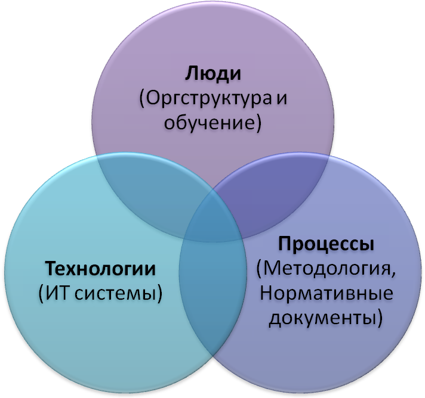

**Корпоративная культура знаний**

Управление знаниями как дисциплина основано на системном подходе к созданию,
сохранению, распространению и последующему применению информации. Однако часто
под тем или иным понятием или набором практик, скрывается просто совокупность
модных терминов. О том, как выглядят реалии управления знаниями, рассказывает
Павел Алферов (Оргкомитет «Сочи 2014»).

**Что следует понимать**

В мире написано немало сочинений на тему, что такое управление знаниями.
Практически в любом их них можно найти множество определений, что под этим
следует понимать, и все они, скорее всего, будут абсолютно правильными. Но если
на проблему посмотреть с чисто практической точки зрения, то знания — это просто
возможность ответить на вопрос, который задали тебе или ты задал себе сам. Смог
ответить — знаешь. Не смог — не знаешь. Соответственно для организации,
управление знаниями сводится к предугадыванию вопросов и подготовке заранее на
них ответов. Особняком стоит тема создания знаний: НИОКР, исследования и проч.
Это особый мир. Обычно же в организации управление знаниями работает с уже
имеющейся информацией.

Например, библиотеки ITIL, управление инцидентами, рекомендуют: случился
инцидент — внеси его в базу знаний. Как правило, в жизни чаще всего случаются
одни и те же события и инциденты. В этом случае самое лучшее — обратиться к
опыту. Когда вопрос задан, то ответ находится быстро и не тратится время на
поиск правильного решения, нужного для устранения инцидента. Управление знаниями
в чистом виде.

Другой пример. Для нас Олимпийские игры в Сочи в 2014 году — это проект.
Сложный, уникальный мега-проект. Для Международного олимпийского комитета (МОК)
и Международного паралимпийского комитета (МПК) — это процесс. Они проводят игры
каждые два года (зимние и летние). У них собралась своя обширная библиотека
знаний, позволяющих ответить на вопрос, как решить ту или иную задачу в рамках
подготовки к очередным Играм.

Вообще по существу каждый из нас занимается управлением знаниями даже на своем
личном уровне:

-   записывая на листочке телефон коллеги, для того, чтобы ему потом позвонить

-   делая на основе уже существующего документа новый

-   проглядывая рекомендации какой фильм стоит посмотреть

Все это примеры управления знаниями (да, мы как известный литературный герой и
не знали, что оказывается всю жизнь говорили прозой).

Но надо понимать, что случайный, несистемный подход даст не так много..

**Система управления знаниями**

В теории все просто и описано с небольшими различиями в тысячах книг на
иностранных языках и в сотнях книг на русском.

-   Определяешь, какие знания будут необходимы организации/ подразделению

-   Определяешь, кому конкретно нужны будут эти знания

-   Определяешь, а какие сейчас есть знания

И дальше строишь систему, которая доставляет 1 для 2 отталкиваясь от 3. Ну а
система, как и любая управленческая система, состоит из трех основных компонент:

**Люди**. Оргструктура и обученные люди, отвечающие за тему

**Процессы**. Процедуры и механизмы, которые регулируют процессы управления
знаниями и порядок применения инструментов УЗ (а уж инструментов напридумано
много: библиотеки материалов, сообщества практиков, семинары по обмену опытом,
координаторы знаний, планы адаптации новичков и проч. и проч. )

**Технологии**. ИТ системы, поддерживающие все вышеперечисленное (базы знаний,
порталы совместной работы и проч.) См. схему.

Кстати ровно та же схема применима и к внедрению, например, проектного
управления.

**Когда оно нужно?**

Тема управления знаниями в компании становится актуальной, когда необходимо
объединить знания нескольких подразделений, когда на уровне формальных
установленных бизнес-процессов уже не получается выполнять работу так, как
раньше, потому что требуется объединять различные компетенции и специалистов.
Когда знания, необходимые для решения новых проблем перестают помещаться в одной
голове. Девиз функции «Управление знаниями» в Оргкомитете: «Никто не знает так
много, как все мы вместе». Если люди могут продолжать работать в своих
подразделениях, решая свои устоявшиеся, хорошо понятные задачи, то управление
знаниями им, в сущности, не нужно. Например, завод, который долгое время
изготовлял одну и ту же продукцию. Но времена изменились, и пришлось переходить
на выпуск чего-то нового.

На самом деле управление знаниями очень тесно связано с управлением проектами, в
основе которых лежит управление изменениями. А управление знаниями — это
фиксация уроков из предыдущих изменений, чтобы в будущем не допустить тех же
ошибок, которые уже были совершены. Если в организации нет изменений, то
управление знаниями в такой компании, скорее всего, не понадобится: все уже
известно, зафиксировано и зарегламентировано в нормативных документах. Это та
причина, из-за которой проваливается внедрение управления проектами во многих
крупных организациях, где нет четких оценок KPI и критериев успешности. Если в
организации все провалено, но никто за это не несет ответственности, то и
управление проектами будет никому не нужно. Более того, оно будет только
раздражать всех участников.

То же самое и с управлением знаниями. Если из-за повторения ошибок никого не
будут наказывать, то зачем все это нужно? Самое сложное в данном процессе даже
не зафиксировать накопленные практики и знания, это как раз можно сделать в
рамках существующей системы регламентации, а как заставить эти знания
использовать!

**Управление знаниями и управление проектами и три главных их врага**

Управление проектами и управление знаниями во многом похожи. Обе дисциплины по
существу про вероятности, про управление этими вероятностями. И обе дисциплины
тяжело приживаются в России.

В чем состоит управление проектами? Ты распределяешь роли, проводишь встречи,
готовишь документы, планы, и все это ради того, чтобы снизить вероятность
неуспеха проекта. Причем что важно – не гарантировать успех проекта (жизнь
богата на неожиданности), но только снизить вероятность неуспеха, уменьшить
последствия от возникающих проблем. Аналогично управление знаниями – мы пытаемся
предугадать вопросы, готовимся к ним, а ведь они могут и не возникнуть. Или
возникнуть, но не совсем так как мы предполагали. «Чтобы правильно задать вопрос
нужно знать большую часть ответа» (с) Роберт Шекли "Верный вопрос". Лучший
рассказ про управление знаниями.

И из-за этой философско-вероятностной природы и управление проектами и
управление знаниями в России приживается тяжело: «Русский человек на трех сваях
крепок - авось, небось и как-нибудь». Эти самые авось, небось и как-нибудь
являются главными врагами внедрения и проектного управления и управления
знаниями… Ведь можно же этого не делать? Можно. Ведь все равно ведь что-нибудь
да получится? Да, все равно что-нибудь да получиться. Ну и бог с ними со всеми,
этими сложностями…

**Культура извлечения и применения знаний**

На самом деле вопросу применимости накопленных знаний предшествует ряд
обязательных процессов. В частности, анализ событий, который привел к тому или
иному неудовлетворительному результату. Это отдельная работа, тесно связанная с
корпоративной культурой. Потому что в российских условиях все может скатиться не
к анализу неудачи и содержательным выводам, а к банальному поиску крайних,
которых назначат виновными за провал, а потом еще и наградят непричастных.

Однако если строго следовать теории, то знания состоят из их извлечения (или
создания, если их нет), сохранения, распространения и многократного применения.
Как правило, извлечение становится сложным процессом именно потому, что люди не
хотят ими делиться. Плюс вмешивается горестная тема явных (tacit) и неявных
(explicit) знаний и преобразования одних в другие. Что сложно. Очень сложно. «Мы
знаем гораздо больше, чем можем сказать». Майкл Поланы.

Сохранение же процесс простой, технологически хорошо отработанный, и в нем ИТ
играет понятную, значимую роль. Благо на рынке инструментов для сохранения и
распространения информации предостаточно. В широком смысле любая ИТ система и
есть такой инструмент.

Проще всего с применением имеющихся знаний у новичков: они еще ничего про
компанию не знают, но хотят узнать, ибо им здесь жить. И их вопросы довольно
легко предугадать и структурировать. У нас есть процесс, который проходит каждый
новый сотрудник. Он организуется HRом, включает цикл тренингов, семинаров и
изучает определенный набор документов. Для тех, кто все-таки не хочет во всем
этом участвовать у нас также есть инструмент.

Есть такая известная поговорка тех, кто занимается управлением знаниями: «лошадь
можно подвести к водопою, но нельзя заставить пить». В результате долгой
практической обкатки я придумал продолжение для этой, в общем-то правильной
мысли: «заставить пить нельзя, но можно проконтролировать выпила ли она и
принять меры, если не выпила». Также и с нашим процессом: мы не можем заставить
человека овладевать знаниями против его желания, но можем проконтролировать
уровень полученных знаний средствами тестирования, проводимого в конце
испытательного срока. Дальше уже решение принимает административный менеджер. В
общем, честно говоря этот подход нельзя назвать новым – он известен любому
студенту: «От сессии до сессии живут студенты весело.»

Важно отметить, что вопрос, какие именно знания понадобятся компании относится
не только к управлению знаниями. Это стратегический вопрос, связанный с планами
и перспективами изменения бизнес-процессов компании.

Так что не стоит ждать от управления знаниями каких-то чудес. Для получения
значимого результата необходимо ежедневно и кропотливо заниматься формированием
системы управления знаниями и соответствующей корпоративной культуры. Это
взаимосвязанные вещи. Однако всегда будут оставаться так называемые серые зоны
ответственности. Например, в управлении проектами подобная зона будет появляться
при передаче информационной системы в эксплуатацию. Когда система сделана и
начинается ее опытно-промышленная эксплуатация — это еще проект или уже процесс?
Вопрос всегда болезненный.

То же самое и с управлением знаниями и корпоративной культурой. Ее частью должно
быть то, что знаниями необходимо, во-первых, делиться, а во-вторых, эти самые
знания нужно потреблять. Собираешься что-то сделать? Посмотри как это решали до
тебя. «Глуп тот, кто учится на своем опыте, я предпочитаю учиться у других и
избегать расплаты за свои ошибки». Отто фон Бисмарк

Я уже говорил, что в отечественной практике как-то не принято делиться своим
опытом. Такую российскую особенность отмечают и западные коллеги. Наши
соотечественники полагают, что чем глубже в себе они хранят какие-то знания и
опыт, тем выше их ценность как сотрудников. Но мы не совсем российская компания.
У нас работает много специалистов с международным опытом, а кроме того, мы очень
тесно взаимодействуем с МОК и МПК. То, что мы должны управлять знаниями и
обмениваться ими, регулируется контрактом с городом — организатором Олимпийских
игр. Контрактом, подписанным между Сочи и МОК/МПК о проведении зимних
Олимпийских и Паралимпийских игр 2014 года. И в данном документе есть отдельный
раздел, посвященный именно управлению знаниями. Для МОК важно, чтобы накопленные
нами знания не пропали и были переданы им, чтобы другие могли в дальнейшем ими
воспользоваться. Мы считаем, что наши определенные наработки и подходы могут
быть применимы в дальнейшем при организации других крупных мероприятий. И мы
будем это пропагандировать и развивать.

**Мой путь**

Айтишники — это люди, которые находятся на стыке функций деятельности компании в
целом. И несмотря на, может быть, внешне безалаберный вид, тем не менее, в силу
специфики своей работы они очень структурированные люди. Хотя бы в своей узкой
деятельности. Иначе нельзя. Если не выстроить правильную последовательность
действий, то система не будет работать, значит, ты не айтишник и не программист.
Еще 40 лет назад Фредерик Брукс говорил «Программисту приходится работать очень
тщательно. В этом смысле ЭВМ напоминает волшебство из сказок. Если хоть один
символ, один пробел в магической формуле не находится строго на своем месте,
волшебство не работает. Люди не привыкли к совершенству, и лишь немногие области
человеческой деятельности требуют его. Привыкание к требованиям совершенной
точности является, по моему мнению, наиболее трудным в процессе обучения
программированию»

Но бизнес в России часто является вещью крайне хаотичной и не структурированной.
Поэтому если в бизнес приходит бывший ИТ-специалист со своим системным взглядом
и способен расширить свои практики, то может добиться заметных результатов. И я
знаю довольно много талантливых айтишников и аналитиков, которые успешно перешли
на бизнес-позиции в компании. Но чтобы применить в бизнесе свой системный
взгляд, необходимо иметь более-менее развитый EQ ([Emotional
intelligence](http://en.wikipedia.org/wiki/Emotional_intelligence)*, EQ или
EI*), то есть эмоциональный интеллект. У айтишников, как правило, очень высокий
IQ (*intelligence quotient*), но заниженный EQ. Но именно эта разница и является
причиной, почему айтишникам лучше живется в своем отдельном мире, в который мало
кому интересно входить. Долгое время я был только айтишником и работал в
небольших компаниях. Потом перешел в ТНК на должность руководителя проекта. Но
для того чтобы быть успешным в этой роли, нужно было развивать коммуникации, и с
этого началось мое взаимодействие с бизнесом.

Еще задолго до того, как я занялся управлением знаниями «по работе» я активно
занимался управлением личными знаниями. Например, у меня есть личная база
знаний, насчитывающая несколько гигабайт: статьи, рассылки, книги. Я фиксирую
то, что мне кажется важным, и предполагаю, что в дальнейшем могу столкнуться с
какой-то проблемой, с которой я сейчас мало сталкиваюсь. Например, с управлением
процессами. И когда мне придется ею заниматься, то я буду к этому более готов.

Точно так же и бизнес. Важно знать, к чему быть готовым, а это самое сложное. Но
если человек предполагает, что ему придется в будущем заняться какой-то
проблемой, то ее необходимо мониторить и фиксировать соответствующую информацию,
которая может пригодиться в дальнейшем, а не собирать все подряд. В этом суть
управления знаниями.
