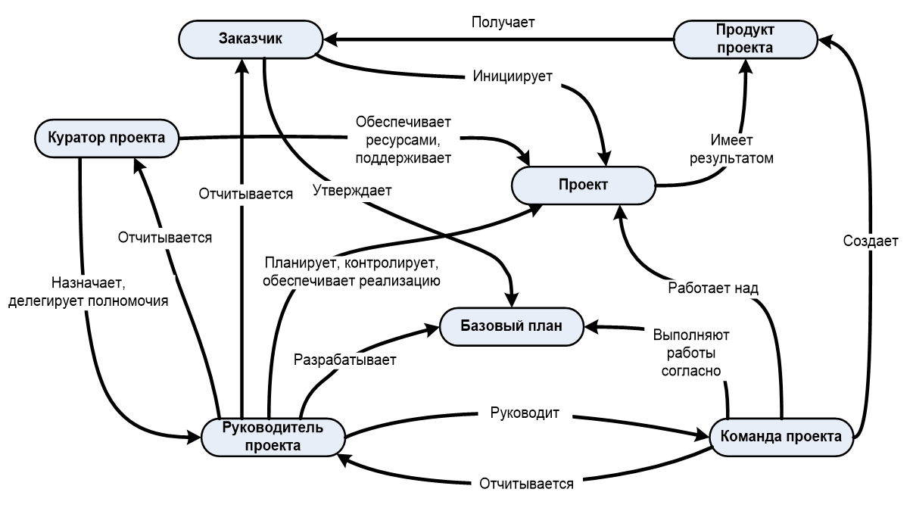

**Текст: Павел Алферов, директор департамента знаний, информации и методологии
АНО «Оргкомитет «Сочи 2014»**

*Первого сентября 2012 года вступают в действие сразу три новых российских
стандарта:*

-   *ГОСТ Р 54869-2011 «Проектный менеджмент. Требования к управлению проектом»*

-   *ГОСТ Р 54870-2011 «Проектный менеджмент. Требования к управлению портфелем
    проектов»*

-   *ГОСТ Р 54871-2011 «Проектный менеджмент. Требования к управлению
    программой»*

*Цель создания этих стандартов — введение общепринятых требований в области
управления проектами, программами и портфелями проектов и, как следствие,
повышение эффективности проектного менеджмента в России. Принятие стандартов
позволит лучше организовать и упорядочить проектную деятельность на российских
предприятиях. По крайней мере так считают авторы — над стандартами работал
большой коллектив профессионалов в области проектного управления.*

Зачем нужны стандарты
=====================

Умные стремятся владеть информацией, мудрые – результатом ее обработки.

Управление проектами на текущий момент является зрелой профессиональной сферой,
но далеко не наукой. Фактически управление проектами сегодня — это набор
наблюдений, лучших практик, применение которых, как было кем-то и когда-то
замечено, приносит положительный эффект. В этих условиях очень важную роль
играют научные статьи, публикации в журналах, выступления на конференциях — они
дают примеры этих практик. Но особую роль играют именно стандарты — при их
разработке профессионалы собирают, анализируют и сводят в единый документ все
достижения сообщества руководителей проектов.

Как показывают современные исследования[^1], возникновение стандартов в
определенной области является отражением зрелости этой области. Оно означает,
что в профессии закончился взрывной рост знаний и началась их организация.

[^1]: Steele, R. (2004). Standards as an indicator of maturity? ... and an
opportunity for customer and industry advantage? International Journal of IT
Standards & Standardization Research, 2(1), 42–45.

В общем можно сказать, что стандарты решают несколько задач:

1.  **Системная картина —** стандарты отражают системную картину области
    менеджмента «управление проектами».

2.  **Концентрация лучшей практики (best practice) —** стандарты в области
    управления проектами содержат лучший мировой опыт в этой области, говорят,
    что нужно делать для успешного выполнения проекта.

3.  **Взаимодействие —** стандарты являются основой взаимодействия и общей
    терминологии, особенно в крупных и интернациональных проектах.

4.  **Сертификация —** стандарты являются основой для сертификации как
    организаций, так и отдельных специалистов в области управления проектами.

При этом необходимо отметить, что подавляющее большинство существующих
стандартов не является истиной в последней инстанции, это именно сборники идей в
помощь проектному менеджеру, «ящик с инструментами», из которого менеджер должен
создать набор, подходящий для его конкретного проекта. Наиболее юридически точно
эта мысль выражена в американском стандарте PMBOK (выделение мое — *П. А.*):

>   Основной целью Руководства PMBOK является выделение той части Свода знаний
>   по управлению проектами, которая обычно считается хорошей практикой. Термин
>   «выделение» предполагает подготовку обобщенного обзора, а не исчерпывающего
>   описания. «Обычно считается» означает, что **описываемые знания и практики
>   применимы к большинству проектов в большую часть** времени, причем
>   относительно их значения и пользы в целом существует консенсус. «Хорошая
>   практика» означает, что в целом существует согласие относительно того, что
>   правильное применение этих навыков, инструментов и методов способно повысить
>   вероятность успеха для широкого диапазона различных проектов. **Хорошая
>   практика не означает, что описываемые знания должны всегда одинаковым
>   образом применяться во всех проектах; возможность их применения для каждого
>   конкретного проекта определяется командой управления проектом***.*

Можно отметить, что аналогичная ситуация сложилась и в области управления
ИТ-процессами — ITIL это не истина в последней инстанции, а свод лучших практик
и рекомендаций на их основе.

Однако есть и исключения из данного правила. Например, швейцарский ИТ-стандарт
Hermes. Все его требования являются обязательными для исполнения в проекте.
Также чаще всего в качестве обязательных к исполнению строятся корпоративные
стандарты по управлению проектами.

Виды стандартов
===============

Всякий раз, когда в текущем процессе появляются отклонения, надо задать
следующие вопросы: «Это случилось потому, что у нас не было стандарта? Это
случилось потому, что мы не следовали стандарту? Это случилось потому, что
стандарт не был адекватным?»

*Маасаки Имаи «Гемба кайдзен: путь к снижению затрат и повышению качества»*

Около 15 лет назад была введена общая классификация стандартов[^2], выделяющая
три основные группы (см. картинку):

[^2]: , W.R. (1998). Presentation to council of chapter presidents. PMI Annual
Symposium. October 10, .

-   **Проекты** — стандарты, фокусирующиеся на знаниях и практиках по управлению
    отдельными проектами. Или иными словами, применимые к отдельным объектам
    управления (проект, программа, портфель проектов) и регламентирующие
    соответствующие процессы управления. Новые ГОСТы относятся к этой группе.

-   **Организации** — стандарты, фокусирующиеся на работе корпоративной системы
    управления проектами. Или иначе применимые к субъектам управления (менеджеры
    проектов, участники команд управления проектами) и определяющие требования к
    знаниям и квалификации соответствующих специалистов, а также к процессу
    оценки квалификации.

-   **Люди** — стандарты, фокусирующиеся на развитии, оценке и сертификатах
    проектных менеджеров.

Стандартизация широко шагает по планете. Посчитано[^3], что на текущий момент
более чем тысячей различных организаций разработано около полумиллиона
стандартов по различным областям знаний. Из них примерно полсотни стандартов
посвящены проектному управлению.

[^3]: Bredillet CN. Genesis and role of standards, theoretical foundations and
socio-economical model for the construction and use of standards. Int J Project
Manage 2003;21(6): 463–70.

Стандарты в области управления проектами разрабатываются как профессиональными
организациями в области управления проектами (PMI, IPMA), так и органами
стандартизации на национальном уровне (ассоциация проектных менеджеров
Великобритании и стандарт APM Body, ассоциация проектных менеджеров Японии со
стандартом P2M и проч.). Свои стандарты есть в Китае, Германии, Австралии и
других развитых странах.

Теперь свои стандарты появились и у России.

Как создавались ГОСТы
=====================

>   Нужно писать только те книги, от отсутствия которых страдаешь.

>   Короче: свои настольные.

>   *Марина Цветаева*

>   ИЛИ

Разработка стандартов была начата в 2008 году, для этих целей компанией PM
Expert, входящей в группу «Армада», и группой компаний «Проектная ПРАКТИКА» была
учреждена Автономная некоммерческая организация «Центр стандартизации управления
проектами» (<http://pmstandard.ru>). В создании проектов национальных стандартов
принимали участие как сотрудники этих компаний (лидирующих на рынке проектного
управления), так и представители крупных российских компаний, в которых активно
внедряются проектные подходы (полный список разработчиков есть на сайте
организации).

Работа проходила в трех экспертных группах, каждая из которых курировала работу
над созданием одного из стандартов. В группах кипели жаркие споры. Особенно
тяжело далось ключевое решение: зафиксировать только «обязательный минимум» —
то, без чего невозможно проектное, программное и портфельное управление. Вместо
подробного описания, как должен реализовываться тот или иной процесс, какие
инструменты при этом должны использоваться, разработчики решили оставить только
самое ключевое — цели и выходы каждого процесса. Это позволило сделать документы
компактными (полтора десятка страниц каждый), наглядными и понятными.

После окончания разработки в начале 2009 года все проекты национальных
стандартов прошли публичное обсуждение, по результатам которого было получено
несколько сот замечаний, комментариев и предложений. В тексты стандартов были
внесены многочисленные корректировки, и финальные версии документов были
переданы в Федеральное агентство по техническому регулированию и метрологии. В
конце 2011 года стандарты были утверждены и с 1 сентября 2012 года они вступают
в силу.

Портфельное и программное управление пока не очень широко распространено в
России, поэтому наибольший интерес чаще всего вызывает стандарт по управлению
проектами.

ГОСТ Р «Требования к управлению проектом»
=========================================

Нет такого закона, который удовлетворял бы всех.

*Катон Старший*

Три важные черты проекта стандарта «Проектный менеджмент. Требования к
управлению проектом»:

1.  **Краткость**. При создании стандарта разработчики принципиально
    договорились не делать «русский PMBOK». Стандарт содержит только то, что
    ОБЯЗАТЕЛЬНО должно присутствовать в деятельности, которая называет себя
    «проектом». Иными словами, если что-то названо проектом, то в нем должны
    быть определенные роли, должны использоваться определенные управленческие
    подходы, инструменты и т. д. Именно такой подход позволил уместить весь
    стандарт в полтора десятка страниц.

2.  **Универсальность.** Требования стандарта распространяются на управление
    любыми проектами и могут быть применены для проектов, реализуемых и
    физическими, и юридическими лицами. Проекты могут осуществляться
    подрядчиками или быть реализованы внутри организации.

3.  **Ориентированность на результаты**. Проект стандарта определяет только
    обязательные выходы процессов управления проектом. Требований к методам
    реализации процессов управления проектами стандарт не содержит. То есть
    организацию процессов управления проектом стандарт не определяет и она может
    варьироваться в зависимости от типа проекта.

**Организация управления проектом**

Согласно проекту стандарта ролевая (организационная) структура управления
проектами может в значительной степени различаться в зависимости от их
специфики. Однако стандарт определяет, что в каждом проекте должны быть
определены следующие четыре роли:

-   заказчик проекта — физическое или юридическое лицо, которое является
    владельцем результата проекта;

-   руководитель проекта — лицо, осуществляющее управление проектом и
    ответственное за результаты проекта;

-   куратор проекта — лицо, ответственное за обеспечение проекта ресурсами и
    осуществляющее административную, финансовую и иную поддержку проекта;

-   команда проекта — совокупность лиц, групп и организаций, объединенных во
    временную организационную структуру для выполнения работ проекта.

**Процессы управления проектом**

Согласно проекту стандарта управление проектом включает совокупность нескольких
процессов, которые объединены в пять групп: инициация, планирование, организация
исполнения, контроль и завершение проекта (рис. 2). Последовательность процессов
управления проектом определятся условиями конкретного проекта, при этом:

-   проект должен начинаться с процесса инициации проекта;

-   проект должен оканчиваться процессом завершения проекта;

-   выполнение процессов организации исполнения и контроля проекта начинается не
    раньше процессов планирования.

Большинство существующих стандартов управления проектами с различной степенью
детализации описывают примерно те же процессы. Описание целей и выходов ключевых
процессов управления проектом приведено в таблице 1.

*Рисунок 1. Процессы управления проектом, объединенные в пять групп*

*Таблица 1. Цели и выходы процессов управления проектом*

| **Группа процессов**       | **Название процесса**                                     | **Цель процесса**                                                                                                                | **Выходы процесса**                                                                                                                                            |
|----------------------------|-----------------------------------------------------------|----------------------------------------------------------------------------------------------------------------------------------|----------------------------------------------------------------------------------------------------------------------------------------------------------------|
| **Инициация**              | **Процесс инициации проекта**                             | Формальное открытие проекта                                                                                                      | Определены и документированы следующие параметры проекта:<ul><li>
наименование проекта;
</li><li>
причины инициации проекта;
</li><li>
цели и продукты проекта;
</li><li>
дата инициации проекта;
</li><li>
заказчик проекта;
</li><li>
руководитель проекта;
</li><li>куратор проекта.</li></ul>|
| **Планирование**           | **Процесс планирования содержания проекта**               | Определение требований проекта и состава работ проекта                                                                           | <ol><li>Определены требования к проекту со стороны заказчика, других заинтересованных сторон проекта, а также законодательства и нормативных актов.</li> <li>Определены требования к проекту со стороны заказчика, других заинтересованных сторон проекта, а также законодательства и нормативных актов. </li><li>Требования проанализированы на предмет возможности их выполнения, согласованы с заказчиком проекта и документированы </li><li>Определены, согласованы с заказчиком и документированы ключевые данные по продукту проекта, а именно: <ul><li></li>назначение, свойства и характеристики продукта;<li>критерии и методы приемки продукта проекта и его составных частей;</li><li>допущения и исключения, касающиеся продукта проекта.</li></ul></li><li>Определены, согласованы с заказчиком и документированы работы проекта, а также допущения и исключения, касающиеся работ проекта.</li></ol>|
|                            | **Процесс разработки расписания проекта**                 | Определение дат начала и окончания работ проекта, ключевых событий, этапов и проекта в целом                                     | <ol><li>Определены взаимосвязи между работами проекта.</li> <li>Проведена оценка длительности работ проекта.</li> <li>Определен и утвержден график привлечения ресурсов, необходимых для выполнения проекта в срок.</li> <li>Определено и документировано расписание проекта.</li> <li>Утвержден базовый календарный план проекта.</li></ol>                                                                                                                 |
|                            | **Процесс планирования бюджета проекта**                  | Определение порядка и объема обеспечения проекта финансовыми ресурсами                                                           | <ol> <li>Определена и документирована структура статей бюджета проекта, позволяющая контролировать затраты на проект в ходе его реализации.</li> <li>Определена плановая стоимость всех ресурсов проекта (материальных и людских) с учетом всех известных ограничений на их использование.</li> <li>Определена стоимость выполнения работ проекта.</li> <li>Утвержден базовый бюджет проекта.</li> <li>Определен и документирован порядок поступления в проект денежных средств.</li></ol>                             |
|                            | **Процесс планирования персонала проекта**                | Определение порядка обеспечения проекта человеческими ресурсами                                                                  | <ol> <li>Определены и документированы роли участников проекта, их функции и полномочия.</li> <li>Определен численный и квалификационный состав команды проекта, а также требования к условиям труда.</li> <li>Персонально определены основные члены команды проекта.</li></ol>                                                                                 |
|                            | **Процесс планирования закупок в проекте**                | Определение порядка и объема обеспечения проекта продукцией и услугами, приобретаемыми у сторонних организаций                   | <ol> <li>Проведен анализ необходимости закупки продукции и услуг для достижения целей проекта.</li> <li>Если по результатам анализа принято решение о целесообразности закупок продукции и/или услуг в проекте, то: <ul> <li>определены требования к закупаемой продукции (услугам), в том числе ограничения по стоимости и срокам поставки;</li> <li>определены требования к приемке закупаемой продукции (услугам);</li> <li>запланированы мероприятия по выбору и оценке поставщиков на основе определенных критериев.</li></ul></li></ol>                                                                          |
|                            | **Процесс планирования реагирования на риски**            | Определение основных рисков проекта и порядка работы с ними                                                                      | <ol> <li>Выявлены и документированы риски проекта.</li> <li>Проведены оценка и ранжирование по вероятности и степени влияния на результат проекта всех идентифицированных рисков.</li> <li>Разработаны мероприятия по изменению вероятности и степени влияния наиболее значимых рисков, а также созданы планы реагирования на случай возникновения таких рисков.</li> <li>Учтены результаты разработки упреждающих мероприятий по реагированию на риски, в связанных с ними планах.</li></ol>                                                                                                                      |
|                            | **Процесс планирования обмена информацией в проекте**     | Определение порядка обмена информацией между лицами, участвующими в реализации проекта и заинтересованными в результатах проекта | <ol> <li>Определены все участники информационного обмена, а также их потребности в информации.</li> <li>Определены методы и средства распространения информации по проекту.</li> <li>Определена процедура разработки, согласования, утверждения, распространения проектных документов.</li> <li>Определены место и правила хранения информации по проекту.</li></ol>                                                                          |
|                            | **Процесс планирования управления изменениями в проекте** | Определение порядка работы с изменениями в проекте                                                                               | <ol> <li>Определен и документирован процесс работы с изменениями в проекте, а именно: <ul><li>выявление изменений;</li> <li>согласование и утверждение изменений;</li> <li>организация учета версий документов и продуктов проекта;</li> <li>доведение информации об изменениях до заинтересованных сторон.</li></ul></li></ol>                                                                                   |
| **Организация исполнения** | **Процесс организации исполнения проекта**                | Организация выполнения проекта согласно разработанным планам                                                                     | <ol> <li>Выполнены запланированные работы. </li> <li>Получены продукты проекта.</li> <li>Изменения осуществлены согласно принятым в проекте правилам.</li> <li>Выполнены намеченные корректирующие и предупреждающие действия.</li> <li>Актуализированы документы по управлению проектом.</li></ol>                                                                                                                             |
| **Контроль**               | **Процесс контроля исполнения проекта**                   | Проверка соответствия процессов и продукта проекта установленным требованиям                                                     | <ol> <li>Документированы результаты регулярной проверки состояния проекта, в частности, отклонения от планов, и проанализированы с целью определения причин отклонений.</li> <li>Произведена оценка соответствия продукта проекта требованиям к нему.</li> <li>Сформированы корректирующие и предупреждающие действия по результатам проверки. </li> <li>Отчеты о выполнении работ проекта соответствуют утвержденной системе отчетности по проекту.</li></ol> |
| **Завершение**             | **Процесс завершения проекта**                            | Формальное закрытие проекта                                                                                                      | <ol> <li>Проведена и документально оформлена приемка продукта проекта заказчиком.</li> <li>Проведено закрытие всех договоров по проекту (в случае их наличия).</li> <li>Документировано окончание проекта.</li> <li>Сформирован архив проекта.</li> <li>Команда проекта и основные заинтересованные стороны проинформированы об окончании проекта.</li></ol>|

Основные понятия, заложенные в стандарт и их взаимосвязи можно увидеть на следующем рисунке.

Выводы
======

Принципы всегда осуществляются медленно, но люди всегда торопятся.

*Оноре де Бальзак, классик французской литературы*

Одно из исследований[^4] показало, что даже в Германии и Швейцарии, которые мы
привыкли считать эталоном «правильности» и следования стандартам, далеко не все
проектные менеджеры реально знают и используют стандарты — всего около 40%. И
даже там, где стандарты используются, они очень редко применяются «как есть»
(только в 10% случаев) — чаще всего они служат базой, на основе которой
организация делает адаптированную для себя методологию.

[^4]: Project management standards – Diffusion and application in Germany and
Switzerland. Frederik Ahlemanna, Frank Teutebergb, Kristin Vogelsangb.
International Journal of Project Management Volume 27, Issue 3, April 2009.

Значит ли это, что стандарты не нужны? Конечно нет. Это означает, что стандартам
еще есть куда развиваться. Но уже сейчас применение проектных стандартов
приносит ощутимую пользу. В том же исследовании большинство использующих
стандарты признало, что это значительно улучшает коммуникации и качество
процессов управления проектами.

Разработчики стандарта надеются, что внедрение ГОСТов позволит добиться
подобного эффекта и в России. Черновик стандарта применялся при разработке
методологии, используемой в АНО «Оргкомитет «Сочи-2014». Данная методология
показала высокую эффективность при управлении проектами подготовки к Олимпийским
и Паралимпийским играм.

Еще раз хотелось бы подчеркнуть, что мы не ставили с целью сделать исчерпывающий
свод знаний по российским подходам к управлению проектами, собрать «лучшую
практику» или построить полную системную картину управления проектами. Скорее
целью было ввести в общий обиход некий обязательный минимум, который позволит
избежать очевидных несуразностей, сплошь и рядом встречающихся в российских
проектах. Разработка же российских сводов знаний по управлению проектами — дело
ближайшего будущего. На эту тему существует много наработок, и думаю вскоре они
превратятся в адекватные практические документы.