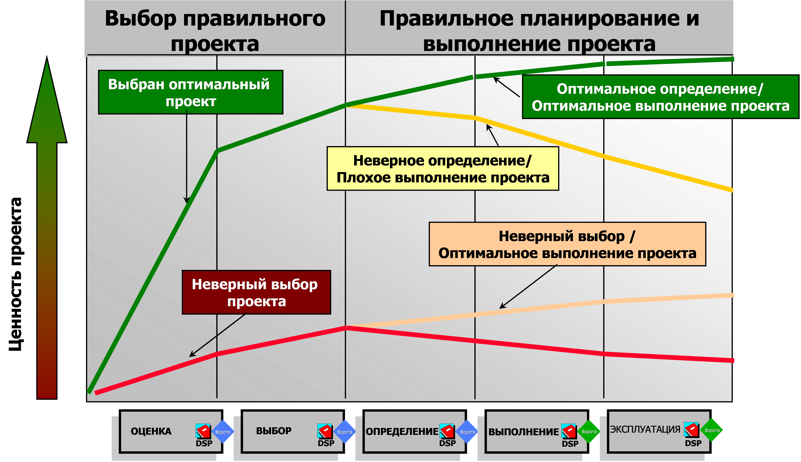
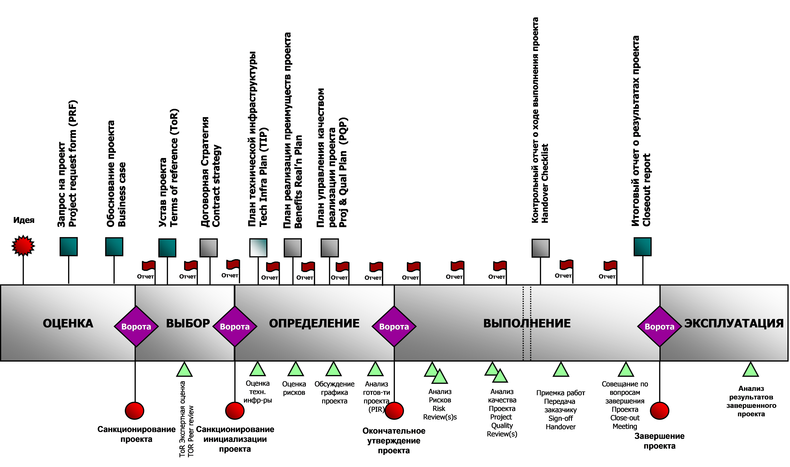

Январь 2013

*Пока ты не сделал свой выбор — возможно всё.*  
Из к/ф «Господин Никто»

Проект – это всегда выбор. Точнее, непрерывная череда выборов. Эта мысль красной
нитью проходит через все проектные методологии, правда, обычно не напрямую, а
через тему принятия решений. Но, если присмотреться, принятие решения и выбор –
две стороны одной медали: решение это всегда выбор из нескольких вариантов, а
выбор это всегда решение…

Тем не менее проектных методологий, которые бы акцентировали внимание именно на
теме выбора, не так много. Тем интереснее посмотреть на те методологии, которые
уделяют этому вопросу особое внимание.

Процесс CVP
===========

В качестве примера можно взять компанию ВР, у которой как раз есть такая
методология, и называется она «Процесс CVP» (Capital Value Process).

«CVP-процесс» возник при слиянии компаний BP и AMOCO, а потому в нем учтены
лучшие наработки по контролю проектов из Group Capital Productivity Process
(GCPP) BP и Amoco Common Process (ACP). В настоящий момент CVP – стандартный
процесс для любых проектов BP, реализуемых как в добывающей сфере, так и в сфере
ИТ. За длительный период использования CVP зарекомендовал себя как эффективное
средство достижения бизнес-результатов.

Процесс представляет собой необычный микс стандартов портфельного и проектного
управления, «заточенный», как сейчас говорят, под идею принятия решений.

Основные принципы CVP:

-   В проекте обязательно наличие двух лиц: **гейткипера (Gatekeeper),**
    принимающего основные стратегические решения по проекту, и **ответственного
    за проект (SPA, Single point of accountability) –** сотрудника, глубоко
    вовлеченного в проект и непосредственно отвечающего за его результат. Обе
    роли обязательно должны выполняться сотрудниками профильных бизнес
    подразделений, а не службы ИТ. **(???)**

-   Все проекты разделяются на **пять этапов (Stages)**, каждый из которых
    соответствует ключевому моменту принятия решений. У каждого этапа своя цель.
    На каждом должен быть выполнен определенный объем работы для достижения этой
    цели.

>   Этапы проекта и их цели:

-   *ОЦЕНКА*. Предварительное технико-экономическое обоснование проекта,
    определение его соответствия стратегии бизнеса.

-   *ВЫБОР*. Выбор предпочтительных вариантов осуществления проекта.

-   *ОПРЕДЕЛЕНИЕ*. Утверждение объема, стоимости и графика проекта, определение
    источников финансирования.

-   *ВЫПОЛНЕНИЕ*. Создание продукта/услуги в соответствии с объемом, стоимостью
    и графиком проекта.

-   *ЭКСПЛУАТАЦИЯ*. Сравнение полученных показателей эффективности с
    планируемыми, оценка и анализ достижения целей бизнеса, обеспечения
    максимальной окупаемости инвестиций.

-   В конце каждого этапа предусмотрены так называемые **ворота/Gates**, которые
    «заставляют» гейткипера и проектную группу принять решение по дальнейшему
    прохождению проекта. Гейткипер может принять одно из четырех решений:
    продолжить проект, приостановить проект, прекратить проект и отправить
    предоставленные материалы на доработку. Последний вариант самый
    нежелательный – он означает, что проектная группа не правильно понимает что
    необходимо Гейткиперу для принятия решения, мало работала с ним.

-   Решения, доводы, приводимые в пользу данных решений, а также все
    неопределенности фиксируются в **«Информационном пакете для принятия
    решений» /Decision support package (DSP)**

-   Под **работой на этапе** понимается сбор и обработка информации, необходимой
    для DSP. Таким образом, какой бы конкретной работой вы ни занимались в
    рамках проекта (протягиванием кабеля, разработкой программы или копанием
    канавы 1,2×12 м) – вся эта активность должна найти отражение в
    информационном пакете.

Основную идею, которая лежит в основе CVP, можно увидеть на этом рисунке:

По оси Y мы отмеряем некую абстрактную ценность проекта: это могут быть деньги
(доллары, рубли и евро), а могут и некие иные, не экономические показатели.
Итак, зеленая линия показывает вариант, когда мы на первом этапе «Оценка»
выбрали правильный/оптимальный проект. Далее на этапе «Выбор» отметили
оптимальный вариант его реализации, а на этапе «Определение» составили наилучший
план, а затем успешно его реализовали и правильно эксплуатируем. Итог: мы
получили максимальную ценность. Если же мы выберем правильный проект, но
реализуем его неоптимальным образом (плохо отработают менеджер проекта и
проектная группа), то полученная ценность будет гораздо ниже. НО: если мы
выберем НЕПРАВИЛЬНЫЙ/НЕОПТИМАЛЬНЫЙ проект, то даже при условии его отличного
выполнения ценность, полученная в результате, будет невысока. Не говоря уже о
ситуации, когда мы неоптимальный проект еще и реализуем неоптимально.

Конечно, все вышеизложенное является некоторым обобщением. Жизнь дарит массу
примеров, когда правильный и нужный проект проваливается из-за плохого
управления или по каким-либо внешним причинам, тем не менее это не отменяет
главного принципа: с точки зрения компании, ЧТО и ЗАЧЕМ вы делаете важнее того,
КАК вы это делаете. Естественно, это никоим образом не отменяет необходимости
профессионального управления проектом, а лишь подчеркивает необходимость
профессионального принятия решений на старте проекта.

Конечно, реальный процесс куда сложнее этого краткого изложения. В частности,
каждый этап проекта требует разработки целого набора документов (см. рисунок).

В краткой публикации невозможно в подробностях рассказать о процессе, для
обучения которому разработан отдельный двухдневный курс. Однако в рамках
спецтемы этого номера стоит подробнее рассмотреть один из этапов процесса,
который, собственно, так и называется – «Выбор».

Этап «Выбор»
============

Выделение этого этапа – очень необычный ход со стороны разработчиков процесса.
Большинство проектных методологий базируют жизненный цикл проекта на стандартных
этапах «Инциация – Планирование – Выполнение –Завершение». А здесь между ними
вклинился «Выбор». Почему?

На самом деле практически в каждом сколь-нибудь сложном ИТ-проекте, после того
как принято решение его запускать (то есть сделан первый, самый важный, как было
показано выше, выбор), возникает необходимость сделать еще один выбор. И даже не
один, а как минимум три:

1.  **Выбор стратегии**. Какова будет стратегия реализации проекта? В простейшем
    случае это порядок выполнения задач на проекте. Например, в проекте
    внедрения ERP-системы мы можем решить запускать модули последовательно, а
    можем внедрять систему целиком и сразу, поставив компанию «на уши» («Большой
    взрыв»). Другой пример: адаптировать под свои нужды существующую систему
    (приняв, что полностью она все-таки не покроет потребности) или разработать
    «с нуля» заказную ИС, приняв все связанные с заказной разработкой риски.

2.  **Выбор платформы**. Тот же пример с внедрением ERP: количество платформ
    велико, у каждой свои плюсы и свои минусы. Необходимо пройти трудный путь,
    «примеряя» системы на себя и анализируя, насколько существенны достоинства и
    насколько значительны недостатки.

3.  **Выбор подрядчика**. Этот вопрос неисчерпаем, как атом. Его решению
    посвящены книги и статьи, читаются курсы и пишутся регламенты. И тем не
    менее ошибки на этом отрезке пути продолжают повторяться, повторяться и
    повторяться. Самая трагическая ошибка совершается, когда на откуп подрядчику
    отдается принятие решений по предыдущим двум вопросам…

Таким образом, в рамках этапа «Выбор» должны быть приняты решения по этим
вопросам и зафиксированы в соответствующих документах (например, в «Уставе
проекта»).

В аналогичном CVP-процессе G5 более жестко отстаивается необходимость
документирования осуществляемого выбора – в нем прямо прописана необходимость
разработки двух отдельных документов: «Методика выбора» и «Обоснование выбора».

*«Методика выбора»* содержит описание подхода к рассмотрению вариантов
осуществления проекта и список предпочтительных вариантов. Документ должен быть
обязательно утвержден владельцем (Гейкипером) проекта до того, как команда
проекта приступит к выбору.

*«Обоснование выбора»* содержит анализ вариантов и предлагаемый проектной
командой вариант. Владелец проекта согласовывает его или требует доработки.

Обобщая можно сказать, что этап «Выбор» выделен специально для того, чтобы
подчеркнуть необходимость проработки и принятия ключевые решения по реализации
проекта до того, ка кприступить к его детальному планированию.

Пример работы процесса 
=======================

Ниже показан высокоуровневый план работ по трем взаимосвязанным проектам
(проекты выделены цветом):

1.  Проект «Выбор стандартной корпоративной системы электронного
    документооборота (СЭД) ТНК-ВР». Проект корпоративного центра по сбору данных
    о потребностях со всех дочерних обществ и анализу рынка систем.

2.  Проект внедрения СЭД в «Варьеганнефтегаз» – одном из дочерних добывающих
    обществ.

3.  Проект внедрения СЭД на Саратовском НПЗ – одном из перерабатывающих обществ.

Все три проекта были тесно взаимосвязаны: дочерние общества в рамках своих
проектов собирали, формулировали и приоритизировали свои требования.
Корпоративный центр в рамках централизованного проекта сверял полученные
требования с другими дочерними обществами, осуществлял анализ рынка, выбор
long-, а затем short-листа поставщиков, обеспечивал проведение тендера для
получения оптимальных цен для всех последующих проектов в дочерних обществах.

Затем выбранная система «пилотировалась» в рамках проектов «Варьеганнефтегаза» и
Саратовского НПЗ, и по итогам внедрения в проекте корпоративного центра
подводились итоги и принималось окончательное решение о соответствии системы
требованиям компании.

Проект прошел очень успешно, все запланированные работы были выполнены в срок и
в настоящий момент выбранная система внедрена в большинстве дочерних обществ
компании.

Заключение
==========

*Россиянину из всех возможных свобод нужна только одна – свобода от выбора.*  
Евгений Лукин

Этап «Выбор», конечно, необходим не во всяком проекте. Например, для проекта
тиражирования уже готового решения выбирать, собственно, не из чего. Но для
большинства проектов, если даже корпоративной методологией этап «Выбор» не
предусмотрен, важно на начальном этапе осознанно сделать три ключевых выбора, о
которых я говорил выше: выбор стратегии, выбор платформы и выбор подрядчика.

Для того чтобы сделать взвешенный, осознанный выбор, человечество выработало
необычайно много разнообразных подходов. Тем, кого с практической точки зрения
интересует разнообразие инструментов, используемых при принятии проектных (и не
только проектных) решений, настоятельно рекомендую изучить «Книгу решений. 50
моделей стратегического мышления» Микаэля Крогеруса и Романа Чеппелера.

Чтобы быть во всеоружии и не уподобиться герою известного комикса.

