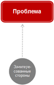

Продолжаю публикацию основных концепций РИМ-III.

Сегодня рассмотрим концепцию Цепочки решения проблемы, одну из базовых концепций модели.

Итак основополагающей идеей является то, что любой проект начинается с **Проблемы**:

кто-то не удовлетворен существующим состоянием дел, что-то не так, что-то болит.

Проблема всегда субъективна. Для Куратора, Заказчика, других заинтересованных сторон она может быть разной.

Поэтому важно проанализировать имеющиеся факты, определить причины и следствия, понять кого затрагивает проблема и кто может стать союзником/противником в ее решении.

Проблема может ожидаться в будущем (риск) или ощущаться как возможность получить что-то дополнительно к тому что уже есть (выгода).

Главное текущая ситуация должна чем-то не устраивать.
**Нет неудовлетворенности/проблемы нет проекта!**

При этом очень важно добиться единого понимания проблемы (или создать единый список проблем, которые должны быть решены если их много).

Вот она, **Проблема**
                    

Дальше начинается поиск вариантов решения проблемы, анализ плюсов и минусов каждого из вариантов.

На основании этого анализа фиксируется выбранный **подход к решению** проблемы и, самое главное, определяются **цели и ограничения**.

Очень важны ограничения (типичные по срокам, бюджету, и проч.) - если ограничения не установлены, то не будет и проекта.

Необходимые работы можно делать в вялотекущем операционном режиме.

Разумеется далеко не всегда анализ проблемы и выход на целеполагание проводится в образцовом организованном и документированном виде, часто он проводится в весьма не формальной форме.

Важно чтобы проводился.

Тут нужно отметить, что если зовут консультантов, то уж они такой анализ делают обычно очень четко. см. например  [книгу Итана Рассела "Метод McKinsey."](http://www.ozon.ru/context/detail/id/28329371/?partner=rim-iii)

Вот появились **Цели, подход и ограничения**
     

Далее мы **запускаем проект**, фиксируя:

- причины запуска (Проблему)
- цели проекта
- ожидаемые результаты – финальные и промежуточные (как декомпозиция целей проекта. См.отдельную Концепцию "Планирование от результатов")
- ограничения и приоритеты (по срокам получения результатов, максимальным затратам  и проч.)
- ключевые роли: Куратор, Заказчик, Руководитель проекта
- ответственных за получение результатов
- ресурсы, выделяемые для получения результатов (административные, денежные, людские, материальные)
- вознаграждение  за получение результатов  и наказание за неполучение результатов

Эти аспекты фиксируются в документе "Запрос на проект" (может также называться "Устав проекта", "Паспорт проекта" и т.д.)

И вот у нас произошел **Запуск проекта**
        

Рабочая группа прорабатывает и фиксирует **требования к результатам**. То есть определяет как должны выглядеть результаты проекта для того, чтобы они могли принести запланированные эффекты. Для простых случаев это делается один раз, для более сложных происходит постепенное уточнение требований - базовые требования (Технические требования, Функциональные требования), детальные требования (Техническое задание, Спецификации и т.д.). Для совсем сложных это будет происходить в итерационном режиме (Гибкий подход, Agile). См.далее концепцию изменения цепочки решения проблемы на основе модели CYNEFIN.

Итак у нас есть **Требования к результатам**
         

Далее в проекте создаются **промежуточные результаты**, а затем и **финальные результаты** (то, ради чего выполнялся проект - Продукт проекта). Получение промежуточных и финальных результатов отслеживается через [контрольные точки](http://rim-iii.postach.io/post/kontseptsii-rim-iii-kontrolnye-tochki) разделенные [по уровням](http://rim-iii.postach.io/post/kontseptsiia-urovnei-kontrolnykh-tochek).

По получению финальных результатов мы **завершаем проект**, отражая в документе "Итоговый отчет" соответствие планов, зафиксированных в "Запросе на проект" реальному положению дел:

- получены ли запланированные результаты
- уложились ли мы в установленные ограничения
- какие были потрачены ресурсы и т.д.

На этом все, **проект завершается.**
Но не завершается Цепочка решения проблемы.

После завершения проекта начинается жизнь Продукта проекта, его использование в рамках процессной операционной деятельности.

**Результаты проекта начинают использоваться и дают эффект (выгоды).** Мы получаем основной эффект от реализации проекта. Какие-то первичные эффекты могут быть получены и в рамках проекта, например, пилотная версия ИТ системы (промежуточный результат)  может сразу начать выдавать необходимую отчетность, сокращая трудозатраты персонала и этим давая часть запланированного эффекта. Аналогично опытной образец продукта (промежуточный результат) , полученный в рамках проекта по созданию нового продукта можно продать и получить какую-то прибыль. Изменения, проведенные в рамках  проекта организационных изменений могут дать эффект еще до завершения проекта, например, выпустив приказ о сокращении ократив обязательное количество  лиц, согласующих официальный документ (промежуточный результат)  эффект можно увидеть очень быстро. И так далее. Но основной эффект проявляется обычно уже после завершения проекта.

И самый главный вопрос всей цепочки - **РЕШИЛАСЬ ЛИ ИСХОДНАЯ ПРОБЛЕМА?!**

Полный оборот цепочки обычно занимает долгое время - несколько месяцев, а то и лет для крупных проектов. И очень может быть, что к окончанию проекта выясниться, что проблема уже не актуальна...

**РЕЗЮМИРУЯ:**

- Проблема решается с использованием результатов, полученных в проекте
- Но проект это только часть общей цепочки решения исходной проблемы
- Для решения проблемы важен не только проект и получаемые в его рамках результаты, но и предпроектная и постпроектная деятельность
- Если они будут выполнены плохо, то успешность проекта (получили результаты в рамках ограничений по срокам, бюджету и т.д.) будет мнимой, т.к. цепочка не замкнется, проблема решена НЕ БУДЕТ
- Таким образом в течение всего проекта должна обеспечиваться прослеживаемость и управляемость цепочки «Проблема->Цели и ограничения->Результаты->Эффект->Проблема» чтобы обеспечить в конце цепочки ответ на  ключевой вопрос: «Решена ли проблема»? - "ДА!"

**P.S. **

Для меня важно общение с теми, кто читает этот блог! Мне важно понимать, что эта тема кому-то интересна. И вообще иногда, даже простое "Спасибо" в конце поста может поддержать, сделать тяжелый день легче и мотивировать на продолжение работы над моделью. Я обязательно читаю ваши комментарии и благодарен за них! Прошу прощения, что не всегда есть возможность ответить каждому. Если у Вас есть вопрос или предложение, пишите на эл. почту - [rim@rim-iii.ru](mailto:rim@rim-iii.ru) или [PavelAlferov@rim-iii.ru](mailto:PavelAlferov@rim-iii.ru) .

*© 2015 Павел Алферов (**[http://www.rim-iii.ru](http://www.rim-iii.ru/) **) Все материалы в этом блоге разработаны мной (если не указано иное). Текст данной публикации является авторским. Данный материал (картинки, фото и текст) принадлежит автору блога. Если Вы хотите разместить этот материал в социальных сетях или в своем личном блоге (в некоммерческих целях), заранее спасибо! Вы можете это сделать не спрашивая моего разрешения, но только при условии активной гиперссылки на оригинал в моем блоге. Для всех остальных случаев: полное или частичное копирование материалов блога разрешено только с личного согласия автора! Я наверняка буду не против, но Вы лучше спросите, чтобы соответствовать [одному из главных правил российских проектных менеджеров](http://rim-iii.ru/forums/vanilla/discussion/60/luchshe-sprosit-i-pokazatsya-durakom-chem-ne-sprosit-i-okazatsya-svolochyu).*