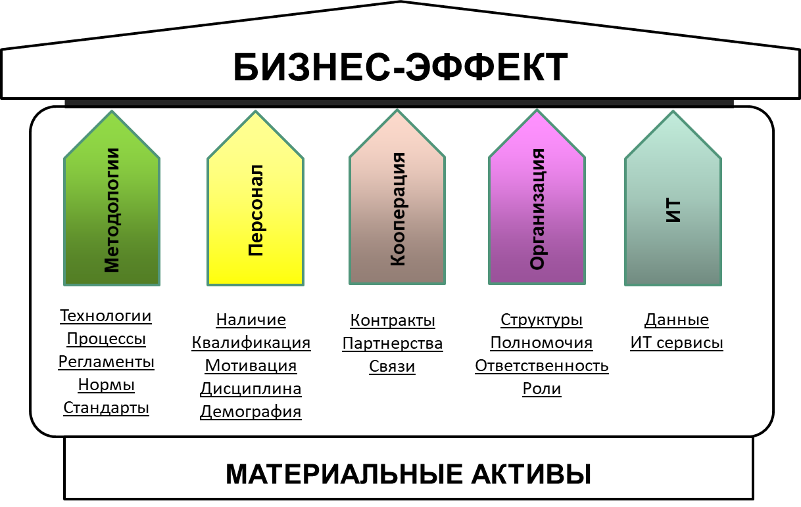

*Павел Алферов, профессор бизнес-практики Московской школы управления СКОЛКОВО*

*Степан Масленников, независимый директор программ цифровой трансформации
бизнеса*

Введение 
=========

Практически все слышали о компании NetFlix. Даже если вы не входите в число 150
миллионов подписчиков этого сервиса, то наверняка сталкивались с их сериалами.
На память сразу приходят такие сериалы, как "Черное зеркало", "Карточный домик",
“Детективное агентство Дирка Джентли” и многие другие. Компания активно
развивается – только в 2018 году Netflix вложили в производство сериалов порядка
8 млрд долларов и собираются наращивать эти инвестиции в дальнейшем.

NetFlix знают практически все, но уже мало кто помнит о компании BlockBaster
Video. А между тем на пике развития в 2004 году эта компания была главным
конкурентом Netflix на рынке. В 9 тысячах магазинах компании работало 84 тысячи
человек, оборот компании достигал 5 миллиардов долларов. Компания занималась
прокатом видео в десятках стран от США до Норвегии. NetFlix создавался как
конкурент BlockBuster Video с бизнес-моделью проката видео кассет и дисков по
почте. И хотя бизнес NetFlix по рассылке дисков шел очень неплохо, основатели
увидели огромные перспективы зарождающегося потокового видео и быстро
перепрофилировали компанию. К сожалению, BlockBaster Video не занялся тем, что
мы сейчас называем цифровой трансформацией. Последствия для него были печальны.
В 2010 году – всего через 6 лет после пика развития – компания обанкротилась.

Очевидный вывод: «Хочешь жить – умей вертеться», или, иными словами, на новый
лад «Хочешь выжить – займись цифровой трансформацией».

С этим тезисом уже мало кто спорит. Весь вопрос в том, как же именно
трансформироваться. В нашей статье мы хотим показать собственникам и
топ-менеджерам несколько типовых сценариев трансформации. Ведь согласно
исследованию Московской школы управления СКОЛКОВО инициатором и постоянной
движущей силой процесса трансформации должно быть высшее руководство[^1] .

>Доклад Московской школы управления СКОЛКОВО и EY «Как понимать цифровую трансформацию»
><https://iems.skolkovo.ru/downloads/documents/SKOLKOVO_IEMS/Research_Reports/SKOLKOVO_IEMS_Research_2017-05-18_ru.pdf>

Дефиниции 
==========

Но чтобы произвести цифровую трансформацию сначала нужно определить, что же
такое «цифровая трансформация»?

Определений существует очень много, мы предлагаем простое и понятное
определение, состоящее из ответа на три вопроса «ЧТО?», «ЗАЧЕМ?» и «ПОЧЕМУ?».

Сначала ответ на вопрос «ЧТО?»:

>   *Цифровая трансформация – это масштабные технологические и организационные
>   преобразования бизнеса.*

При этом это только часть определения. Необходимо дополнить его целью («что она
дает?»)

>   *Целью этих преобразований является:*

-   *кардинальное повышение эффективности бизнеса и/или*

-   *формирование принципиально новых бизнес-моделей и/или*

-   *создание инновационных продуктов и услуг*

А еще надо дополнить предпосылками («почему это стало возможно и необходимо?»).

>   *Цифровая трансформация стала возможна благодаря резкому развитию трёх
>   базовых цифровых технологий - хранения, передачи и обработки информации.*

>   *Показатели процессов (объемы хранения, скорость передачи,
>   производительность, миниатюрность) резко выросли, при этом стоимость
>   драматически упала.*

>   *Из-за этого открылось огромное количество новых бизнес-возможностей.*

Отталкиваясь от этого определения, можем приступить к описанию трансформации.

Ключевые факторы
================

Существует много факторов, которые необходимо учесть, когда мы говорим о
реализации программы цифровой трансформации – корпоративная культура, стиль
лидерства руководства, предыдущая история изменений в компании и множество
других.

При этом с нашей точки зрения стоит выделить четыре ключевых фактора:

-   Срочность

-   Доступность технологий

-   Готовность команды к переменам

-   Качество и охват основных данных

**Срочность.** Вопрос: «Поджимает ли время?»

-   Конкуренты уже получают преимущество за счёт диджитал или реализуют проекты?

-   Большие игроки выходят или собираются выходить на ваш рынок (например,
    Яндекс, Сбер, AliExpress и пр.)?

-   Прежние методы работы не позволяют расти или даже оставаться на прежнем
    уровне?

Развилка:

Если время поджимает и для вашего бизнеса появились реальные угрозы, то
вариантов не много - надо действовать, если не хотите повторить судьбу
Blockbuster Video. Необходимо искать возможности и запускать пилотные проекты,
пробовать цифровые технологии непосредственно в вашем бизнесе, искать работающие
подходы и проверять жизнеспособность новых бизнес-моделей. Как? Об этом чуть
позже.

Если же ваш сегмент рынка чувствует себя спокойно и есть основания полагать, что
резких изменений в ближайшие три года не будет, то для вас есть варианты. И
решение о "входе" в трансформацию будет зависеть от остальных факторов. Только
точно ли так? Стоит вспомнить про Uber и Яндекс, которые вышли на очень далёкий
от диджитала рынок такси и очень сильно изменили его всего за несколько лет.

**Доступность технологий**. Вопрос: «Доступны ли вам необходимые технологии?»:

-   В вашей индустрии есть успешные примеры применения диджитал в бизнесе?

-   На рынке доступны квалифицированные человеческие ресурсы для реализации
    проектов?

-   Технологии отработаны и готовы к промышленному применению (например,
    автономная доставка пока ещё не доступна)?

Развилка:

Речь не в целом о развитии искусственного интеллекта или последних наработках
мировой робототехники, а о том, какие технологии вы можете пробовать внедрять в
бизнес уже сегодня. Например, если вы видите потенциальный эффект от мобильных
продаж, сбора больших данных о поведении ваших клиентов или о вашем
производстве, то это очевидно первые кандидаты на пилотные проекты. Обзоры и
таблицы применимости по индустриям появляются с завидной регулярностью.

Если же на поверхности примеров нет, то стоит обратить внимание на соседние
индустрии, на "больших игроков" и на технологические стартапы, у которых есть
уникальные компетенции, но которым очень нужны партнёры для практического
применения их наработок. В любом случае, важно держать руку на пульсе.

**Готовность команды к переменам**. Вопрос: «Насколько ваша компания готова
меняться?»

-   В вашей компании присутствует культура изменений и есть опыт проектного
    управления?

-   Возраст коллектива, не мешает воспринимать новые сложные технологии?

-   Зрелость процессов высокая, не возникает сложностей при замене кадров?

-   Среди ваших сотрудников нет "священных коров" (например, на которых держатся
    ключевые контакты/контракты), которые могут противиться изменениям?

Развилка:

Диджитал трансформация требует появления у сотрудников большого количества новых
компетенций. Могут измениться не только методы работы, полномочия и
ответственность сотрудников, но и сама бизнес-модель работы компании, включая
партнеров, клиентов, да и в целом цепочку создания ценности. Если ваши люди
готовы меняться, умеют реализовывать проекты, в компании нет сложных
внутриполитических отношений, а «невключающихся» в изменения людей можно
безболезненно заменить, то скорость вашего движения вперед может быть
существенно выше, а количество усилий, которые надо будет потратить на
преодоление сопротивления ниже.

Если же вы не можете позволить себе объявить "кто не меняется, того заменяем",
жестко ставить задачи и назначать ответственных, держать курс на диджитал, то
скорость трансформации будет гораздо ниже. Новых людей придется вводить
осторожно, "мягко" формировать команду трансформации и внедрять поэтапный подход
к изменениям.

**Качество и охват основных данных.** Вопрос: «Насколько зрелы ваши процессы
работы с ключевыми данными (их сбором, обработкой и хранением)?»

-   В системах есть ключевые данные по бизнесу компании

-   Вы доверяете тем данным, которые получаете из систем

-   Вы можете положиться на качество вашей справочной информации (полноту,
    непротиворечивость).

-   Информация и аналитика трактуются прозрачно и одинаково на различных уровнях
    организации.

Развилка:  

**Качество и охват основных данных** (сбор, обработка, хранение)

Диджитал строится и работает на данных. На их качестве, полноте,
непротиворечивости.

Насколько хорошо у вас организованы процессы, в которых данные собираются,
обрабатываются и хранятся?

Если вы можете опереться на ваши данные и доверять качеству вашей отчетности, то
реализовывать пилотные диджитал проекты будет много легче - не придется
заниматься доведением до ума внутренних справочников (например, справочников
продукции и контрагентов).

В противном же случае, скорее всего, незрелость процессов и ключевых систем
может серьезно блокировать попытки внедрения диджитала. И вполне возможно, что
придется в первую очередь приводить в порядок именно аспект работы с данными в
компании. Заниматься внедрением или перевнедрением базовых ИТ-систем.

Разные сочетания прохождения развилок порождают ряд типовых сценариев.  

Модель комплементарных активов 
===============================

Для того, чтобы системно представить сценарии мы будем опираться на модель
комплементарных активов. Понятие комплементарного актива введено в исследовании
экономистов Пола Милгрома и Джона Робертса в 1990 году.

Комплементарные активы – это активы, дополняющие друг друга таким образом, что
увеличение одного актива увеличивает эффект от инвестиций в другой.
Комплементарные активы взаимно увеличивают эффективность друг друга
(complementary – англ., взаимодополняющий).

Другими словами, комплементарные активы – это те, которые необходимо развивать
вместе. Если развивать только один актив, без учета связанных с ним, то
получаемый эффект будет минимальным или вовсе отрицательным.

Исходя из этой теории организацию можно представить как набор комплементарных
активов – пазл, в котором каждый элемент связан с другим и влияет на него. И
когда мы хотим поменять организацию невозможно поправить один элемент –
необходимо менять все связанные с ним.

Видов комплементарных активов существует очень много, для целей цифровой
трансформации имеет выделить пять ключевых:

Только при совместном изменении этих пяти активов возможно получение
бизнес-эффекта. Далее сценарии трансформации мы будем разбирать на основе этих 5
элементов, выделяя самые важные для каждого сценария.

Типовые сценарии
================

Итак, можно выделить несколько типовых сценариев

**Сценарий 1. «Время, вперед!»**

**Время поджимает, технологии есть, команда готова к переменам, качество данных
на должном уровне**

 

Всё в ваших руках и у вас, скорее всего, есть отличные помощники, построившие
существующий бизнес и его систему управления. Смело начинайте пилотные проекты,
ставьте амбициозные задачи вашим сотрудникам, организуйте их в продуктовые
команды, привлекайте новых людей извне компании. Ваша цель стать цифровым
лидером рынка.

Первые шаги:

-   Первым шагом необходимо определить ключевых людей – проводников дальнейших
    изменений. Найти советника по диджитал вопросам из людей с широким
    кругозором, имевших опыт работы с новыми технологиями. Для развития
    персонала необходимо составить список конференций, которые необходимо
    посетить вам и вашим ключевым сотрудникам. И не забывайте, что компетенций,
    которых не хватает вашей команде, можно купить на рынке – сейчас уже много
    специалистов имеющих опыт изменений. Не всегда он положителен, но тем он
    ценней!

-   Далее нужно провести стратегическую сессию для определения приоритетных
    пилотных проектов совместно с ключевыми членами команды.

-   Запуск изменений в методологии работы: у вас хорошо работают существующие
    процессы, но для цифровой трансформации необходимо применение принципиально
    новых подходов, таких какие agile, продуктовый менеджмент и пр. На эту тему
    есть много курсов, много литературы и экспертов, которые готовы помочь.

-   Запуск обмена опытом через кооперацию и референс-визиты с ведущими игроками
    других рынков (из схожих индустрий или из других стран). Стоит использовать
    профессиональные сообщества для влияния на внешнюю среду для проработки
    регуляторных или законодательных изменений. В конце концов можно просто
    купить компанию с опытом.

-   На основании собранной информации нужно запускать первые пилотные проекты.
    Их быстрый старт поможет не только придать импульс всей организации, но и
    позволит выявить внутренние барьеры и определить точки, которые необходимо
    усилить.

-   С точки зрения организации, создайте для новых проектов новые условия работы
    (рабочее пространство, график, культуру общения, онлайн инструменты).

**Сценарий 2. «Медленно и печально»**

**Времени достаточно, нет технологий, команда не готова к переменам, низкое
качество данных**

Вам повезло, что у вас есть время подготовиться к большим изменениям. Диджитал
рано или поздно придёт во все сферы, но вполне возможно, что к тому моменту,
когда он доберется до вашей индустрии, на рынке появятся доступные и проверенные
цифровые технологии. Можно просто ждать. Но важно, чтобы компания и команда были
к этому подготовлены. Ваш приоритет - внутренние процессы и «мягкая»
трансформация. Создайте офис трансформации, развивайте компетенции проектного
управления, управления изменениями, последовательно вовлекайте сотрудников.

Первые шаги:

-   И в этом сценарии начать необходимо с персонала. Начните формировать команду
    трансформации, развивать и обучать ее. Если есть внутренние сотрудники
    готовые и жаждущие перемен, то подключайте их. Если нет, то начинайте
    подбирать с рынка и аккуратно вводить в компанию. Потихоньку втягивайте
    существующих сотрудников в изменения.

-   Стоит создать отдельную организационную структуру – Центр компетенций по
    цифровой трансформации. Он должен находиться под непосредственным
    управлением первых лиц компании. Вполне возможно, что публично не стоит пока
    употреблять слово трансформация, а заменить его «операционными улучшениями»,
    развитием и т.п. Созданный Центр должен разработать программу проектов
    повышения операционной эффективности. Начните реализацию с небольших
    проектов и инициатив. Регулярно подчеркивайте важность изменений и обращайте
    внимание, что проводите их мягко, но настойчиво.

-   ИТ – важный элемент, без которого вам не обойтись. Займитесь вашими
    системами и данными. Нужно привести их в порядок. Также важно наладить
    процесс отслеживания доступных технологий. Профессиональные конференции и
    участие в сообществах профессионалов помогут вам в этом.

**Сценарий 3. «Шаг в сторону»**

**Время поджимает, нужные технологии есть, но команда не готова к переменам и у
вас низкое качество данных**

Когда рынок меняется быстро, но компания не готова гибко реагировать на
изменения (при этом вполне комфортно работает в рамках существующего рынка).
Стоит создать отдельную дочернюю компанию (спин-офф). Правила работы текущего
бизнеса не должны как-то ограничивать новый, при этом для нового стоит поискать
пути использования существующих активов и наработок.

Первые шаги:

-   Определите какой новый продукт с использованием диджитала вы можете
    предложить рынку, на котором вы уже работаете.

-   Создайте новую компанию под развитие этого продукта. Или рассмотрите
    возможность покупки уже существующей компании-стартапа. Отдельная компания
    не самоцель. Цель – скорость вывода продукта на рынок. Нужно обойти
    внутренние барьеры существующего бизнеса.

-   Если есть отдельные персоналии из существующего бизнеса, которые
    заинтересованы в производимых изменениях, то привлекайте их. В целом
    сложившуюся команду лучше трогать «по минимуму». Определите каких
    компетенций вам не хватает в новой компании. Набирайте молодую команду,
    которая начнёт пробовать создавать и выводить продукт на рынок.

-   Методология работы новой компании должна быть максимально гибкой, нацеленной
    на формирование гипотез и их проверку на рынке. Минимум формализма.

**Сценарий 4. «Человеческий фактор»**

**Времени достаточно, технологии есть, команда не готова к переменам, качество
данных высокое**

Компания может быть вполне довольна своим положением на рынке. Сотрудники
прекрасно чувствуют себя на своих местах и не стремятся к переменам. Можно
ничего не делать, но стоит вспомнить о судьбе книжных магазинов США – в 2004
году их было 37 тысяч, на текущий момент закрылось уже более 15 тысяч– их
«съела» цифра. Надо подумать, как подготовиться к грядущим изменениям, если
технологии уже есть, значит скоро их кто-то применит.

Первые шаги:

-   Ключевые организационные преобразования должны касаться создания центра
    экспертизы / центра компетенции («команды прорыва»).

-   С точки зрения работы с персоналом важно организовать постоянное обучение по
    управлению проектами, управлению продуктами, управлению изменениями. Нужно
    заняться корпоративной культурой и развитием ключевых лиц – демонстрировать
    им успешные примеры новых технологий и подходов.

-   В рамках Кооперации проводить референс-визиты в успешные диджитал компании.

**Сценарий 5. «Партнерство»**

**Время поджимает, технологий нет, команда не готова к переменам, качество
данных высокое**

Нужно действовать быстро. Конкуренты из соседних отраслей влияют на ваш рынок
или ваши ключевые показатели. История с Яндекс.Такси у всех на слуху. Другой
пример – это судьба печатных журналов. Нет времени растить свои компетенции. На
помощь могут прийти партнерства как с технологическими лидерами рынка, которые
могут принести опыт других индустрий, так и работа со стартапами, которым
необходимо партнерство с бизнесом. Важно совместно определять цели пилотных
проектов и оценивать возможность переключения приоритетов на новый бизнес в
случае их успеха. Ваше умение работать с данными, хорошее знание рынка и есть
ваш вклад в партнерство.

Первые шаги:

-   Основной фокус в данной ситуации нужно делать на кооперацию. Ищите
    партнеров, в сочетании с которыми вы сможете предложить рынку новые
    продукты, у которых хотя бы один из ключевых параметров может быть
    существенно больше ваших текущих (например, количество клиентов, средний
    чек, маржинальность и пр.).

-   Продолжайте развивать ваши цифровые данные – они основа цифрового бизнеса.

-   Ваши лучшие сотрудники – это отличный источник критики новых продуктов. Но
    важно воспринимать её не как истину в последней инстанции, а как повод
    «взломать» текущую ситуацию.

Заключение и выводы
===================

Теперь после разбора дорог, которые может выбрать инициатор цифровой
трансформации вернемся на минутку к истории BlockBaster Video[^2]. Согласно
классификации выше она находилась в ситуации 1 – они понимали, что нужно
меняться, у них всё было для того, чтобы рвануть вперед (и процессы, и люди и
ИТ), но они недооценили конкурентов и пропустили время, когда необходимо было
начинать активную трансформацию. BlockBaster Video не решилась пойти в
неизведанную для них технологическую область. Забавно то, что они даже отвергли
предложение о покупке Netflix, не считая их серьезным конкурентом. А когда уже
после банкротства были куплены кабельной телевизионной сетью соперничать с
Netflix было поздно. Blockbuster так и не удалось вернуться в серьезный бизнес.

>Подробно она изложена в статье на популярном ресурсе vc.ru  
><https://vc.ru/story/11739-netflix-story>

В старом советском фильме «Деловые люди» есть миниатюра «Дороги, которые мы
выбираем». Она наиболее известна цитатой «Боливар не вынесет двоих», но в ней
есть еще одна замечательная фраза «Дело не в дороге, которую мы выбираем; то,
что внутри нас, заставляет нас выбирать дорогу». Дорога цифровой трансформации
тоже выбирается исходя из того, что есть внутри вас, внутри вашей компании.
Чтобы не повторить судьбу Blockbuster выберите свой сценарий и твердо идите по
нему!
